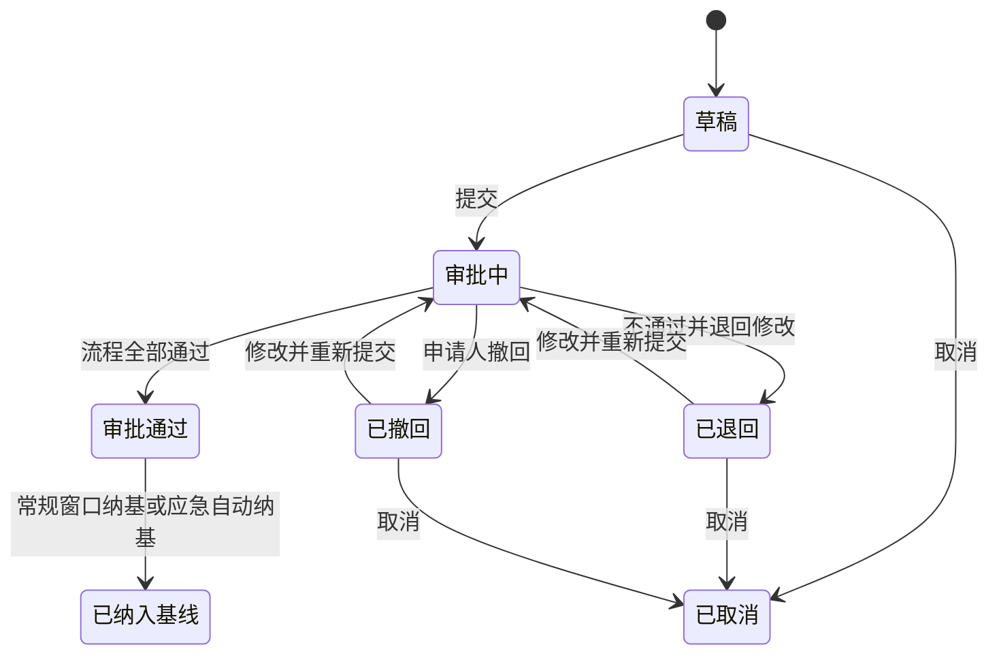

# 配置管理与版本发布控制模块工程设计

## 文档状态

- 需求编号：`REQ-20260814-021`
- 主题：`release-management-module`
- 修订：4
- 状态：待复核
- 用户确认依据：用户逐项确认需求澄清、选择方案 A，并批准仅将 `ccb-release` 业务模块设计落盘；平台底层能力另行设计。

## 1. 目标与成功信号

在 RDDMP 中新增独立的版本发布控制业务模块，让当前项目的研发人员能够登记投产版本申请，按投产窗口和历史版本自动判断业务场景，接入平台审批，最终形成按物理子系统和交付单元可追溯的版本基线。

成功信号：

1. 投产窗口、版本申请、审批轮次、基线批次和版本替代链可以双向追溯。
2. 五种申请场景无需用户选择即可稳定匹配固定流程编码。
3. 常规版本按窗口一次纳基，应急版本审批通过后自动纳基，重复执行不产生重复基线。
4. 项目级和窗口级报表与列表、基线明细及 Excel 导出口径一致。
5. 业务模块不读写平台工作流、系统通知或对象存储私有表。

## 2. 使用者与场景

### 2.1 研发人员

- 在顶级当前项目下查看可用投产窗口。
- 新建版本申请，选择物理子系统和交付单元，登记制品版本、需求编号、说明和附件。
- 查看历史冲突提示，保存草稿、提交、撤回、取消、催办和重新提交。
- 在申请详情查看当前节点、处理人、流程图、审批记录、签名和基线结果。

### 2.2 测试人员与其他审批人

- 从平台统一待办或申请详情进入同一审批上下文。
- 查看业务申请、附件、历史版本和流程进度。
- 按节点规则提交通过或不通过、意见和平台内部电子签名。

### 2.3 配置管理员

- 维护当前项目的投产窗口和常规申请开关。
- 查看全部申请、审批和冲突记录。
- 投产完成后从窗口执行一次常规基线纳入。
- 处理应急自动纳基失败和查询完整版本演进。

### 2.4 平台管理员

- 管理菜单、权限和平台公共能力。
- 不代替测试、配置管理或其他业务审批人作出审批结论。

## 3. 必须需求与验收条件

| ID | 必须需求 | 可验收结果 |
|---|---|---|
| R1 | 独立 `ccb-release` 模块拥有窗口、申请、基线和报表业务数据 | 平台模块不出现发布业务表或业务状态代码 |
| R2 | 所有数据受当前项目、租户、RBAC、数据范围和实体权限约束 | 跨项目、跨租户和无权限请求被服务端拒绝 |
| R3 | 窗口日期、同项目不重叠、项目不可修改和常规开关规则成立 | 正常、边界和非法窗口输入有自动化验证 |
| R4 | 系统根据日期、窗口和历史版本计算五种申请场景 | 每个日期边界和追加组合均得到唯一场景及流程编码 |
| R5 | 申请只含一个物理子系统和至少一个完整交付单元版本 | 草稿和提交均拒绝空交付单元或空版本 |
| R6 | 常规需求编号、应急说明、超期原因和追加原因按场景校验 | 缺少相应字段时保存或提交行为符合规则 |
| R7 | 重复、在途、追加和跨窗口历史检查符合已确认口径 | 阻断、提示、复制申请单号和详情下钻可复验 |
| R8 | 状态机、撤回、退回、取消、转应急和多轮提交完整留痕 | 不允许非法状态跳转，历史轮次不被覆盖 |
| R9 | 五个固定流程编码驱动工作流，不提供流程选择 | 未发布或结构不合规流程阻止提交 |
| R10 | 申请详情呈现流程进度、意见、轮次和签名，审批只产生整单结论 | 统一待办和业务详情指向同一申请和任务，不能按交付单元部分通过 |
| R11 | 常规窗口从投产结束次日起一次性纳基 | 阻塞申请存在时零批次；成功后不可重复或撤销 |
| R12 | 应急审批通过后自动纳基并支持幂等重试 | 失败保留审批通过，成功只产生一个批次和一组明细 |
| R13 | 基线按批次、物理子系统和交付单元维护历史与最新指针 | 旧常规版本不能回退后续应急最新基线 |
| R14 | 追加和应急版本形成明确替代链 | 每个被替代版本可定位替代申请、版本和日期 |
| R15 | 申请操作、窗口修改、附件、导出和纳基全程审计 | 操作人、对象、前后值、原因和时间可查询 |
| R16 | 项目级和窗口级报表实时计算并可下钻、导出 | UI 指标、列表结果和 Excel 工作表统计一致 |
| R17 | 业务模块通过五个外部端口协作，不依赖平台私有实现 | 模块测试可以用端口 Stub 独立运行 |
| R18 | Mock、菜单权限和表单元数据由 Agent 自动初始化 | 全新本地数据库无需人工配置且重复加载幂等 |
| R19 | 本期桌面端完成全部核心任务 | 桌面浏览器可完成窗口、申请、审批查看、纳基和报表流程 |

## 4. 不变量与约束

### 4.1 业务不变量

- 一张申请单只属于一个租户、一个项目、一个窗口和一个物理子系统。
- 一个申请内同一物理子系统与交付单元组合只出现一次。
- 一个交付单元只有一种制品类型，申请保存该类型快照。
- 同一窗口、同一交付单元、同一版本不能有多张有效申请。
- 审批通过后的业务数据不可编辑、撤回或取消。
- 常规窗口基线每个窗口最多一个，应急基线每个申请最多一个。
- 基线批次和已纳入基线记录不可撤销或物理删除。
- 最新基线变更不删除历史版本。

### 4.2 工程约束

- Java 17、Spring Boot 3.4.4、MyBatis-Plus、MySQL 8.4、Vue 3 和 TypeScript。
- 保持现有 `com.ccb.*` 包名兼容边界。
- 数据库迁移只追加 Flyway 脚本，不修改已发布迁移。
- API 使用 `/api` 和统一 `ApiResponse`。
- 业务表必须包含租户、审计、乐观锁和必要索引。
- 前端优先复用交付示范中心和 `web/src/components/ui`。
- 本需求按用户决定申请移动端例外，只设计和验收桌面端；不修改平台现有移动能力。

## 5. 非目标

- 平台项目上下文、工作流、统一待办/已办、电子签名、通知和持久附件的内部实现。
- AI、外部需求/缺陷系统、代码仓库和制品仓库集成。
- 制品文件上传、哈希、防篡改存证和 CA 数字签章。
- 版本大小、连续性、正式版、Beta、Hotfix 和语义版本校验。
- 组会工作台、投产执行、部分成功、回退和确认未投产。
- 审批效率评价指标。
- 移动端业务页面。

## 6. 方案比较与选择

### 6.1 已选：单一版本发布业务模块，内部按领域拆分

新增 `server/src/modules/release/` 和 `web/src/modules/release/`。窗口、申请、基线和报表在同一 Maven 业务模块内拥有独立包、服务和表，通过领域服务协作。

选择理由：

- 窗口纳基、追加识别和报表需要一致事务和高频联合查询。
- 业务所有权集中，仍可通过内部包边界保持可维护性。
- 符合 RDDMP 模块化单体和“平台能力不拥有业务状态”的现有规约。

### 6.2 未选：拆成窗口、申请、基线报表三个 Maven 模块

排除原因：当前规模下会为高耦合事务引入过多接口、事件和一致性成本。

### 6.3 未选：以工作流为事实源

排除原因：窗口、冲突、基线和报表规则会反向侵入 Flowable，削弱业务模块独立维护能力。

## 7. 架构边界与组件职责

```text
ccb-release
├── window          投产窗口、日期、开关和窗口审计
├── application     申请、场景、冲突、状态和审批轮次
├── baseline        批次、明细、最新指针、替代链和自动重试
├── reporting       实时聚合、下钻条件和 Excel 导出
├── attachment      申请附件关联与状态权限
├── integration     外部端口和适配 DTO
└── web             HTTP Controller、请求和响应 DTO
```

### 7.1 外部端口

| 端口 | 模块需要的契约 | 当前文档不负责 |
|---|---|---|
| `ReleaseProjectContextPort` | 当前项目、项目快照、用户项目权限 | 顶级项目切换和平台安全上下文实现 |
| `ReleaseMasterDataPort` | 查询物理子系统、交付单元和制品类型 | 研发管理内部表和服务实现 |
| `ReleaseWorkflowPort` | 按编码启动、终止、查询和接收生命周期事件 | Flowable、统一待办/已办、签名和通知实现 |
| `ReleaseNotificationPort` | 幂等发布站内业务通知 | 系统消息表和消息中心实现 |
| `ReleaseAttachmentPort` | 上传、下载、预览、删除和附件元数据 | MinIO、文件预览及平台附件表实现 |

正式环境端口缺失时不得使用 Mock 降级。`local` profile 可以装配虚构适配器用于独立开发和验收。

### 7.2 实施写入边界

本需求的完整实施范围不止设计文档，还包括：

- 后端业务模块：`server/src/modules/release/**`
- 前端业务模块：`web/src/modules/release/**`
- 前端路由：`web/src/router/index.ts`
- Maven 聚合与启动装配：根 `pom.xml`、`server/src/platform/boot/pom.xml`
- 新增 Flyway 迁移：`V37__release_management.sql`；`V35/V36` 由前置平台业务集成需求使用
- 模块治理登记：`governance/modules.yaml`、`docs/architecture/MODULES.md`、`.github/CODEOWNERS`
- 本需求的实施计划和工程控制证据

以上路径已写入本需求的 `codex-task-scope.yaml`。平台工作流、系统通知、附件、认证和共享模块内部源码仍为只读；它们的能力补充必须使用后续独立平台需求授权。

## 8. 用户入口与页面信息架构

```text
配置管理
├── 投产窗口
├── 版本申请
├── 基线管理
└── 统计分析
```

工作流设计、统一待办和已办属于平台入口。待办点击业务路由进入版本申请详情，配置管理不重复建设审批任务列表。

### 8.1 投产窗口

- 列表筛选窗口编码、名称、日期、开关和基线状态。
- 列表展示项目、申报周期、投产周期、申请数量、开关和基线状态。
- 新建、编辑使用 `UiFormDrawer`；项目只读，编码系统生成。
- 详情展示申请汇总、阻塞清单和窗口纳基操作。

### 8.2 版本申请

- 桌面服务端分页列表展示申请单号、物理子系统、交付单元数量、窗口、场景、状态、当前节点、处理人、申请人和更新时间。
- 新建、编辑使用独立页面，按“上下文 -> 交付单元 -> 需求与说明 -> 附件”排列。
- 冲突弹框展示交付单元、本次版本、历史版本、历史申请单号、状态、复制和详情入口。
- 详情页签为“申请信息、审批进度、附件、操作日志、版本关系”。
- 审批进度展示平台返回的流程图、当前节点、处理人、时间线、轮次、意见和签名。

### 8.3 基线管理

- 分别查看窗口常规批次、应急批次和当前最新基线。
- 按物理子系统、交付单元、制品类型和版本检索。
- 版本历史抽屉展示来源申请、批次和替代链。

### 8.4 桌面端例外

用户明确决定本期不做移动端。页面不得通过缩小字体或整页横向滚动伪装移动适配；需求验收只覆盖桌面浏览器。后续移动适配必须单独立项。

## 9. 投产窗口规则

### 9.1 字段

- 窗口 ID、窗口编码、窗口名称
- 项目 ID、编码、名称快照
- 申报开始日期、申报截止日期
- 计划投产开始日期、计划投产结束日期
- 允许常规申请开关、常规基线状态
- 窗口说明、创建/更新审计和乐观锁版本

### 9.2 校验

```text
申报开始 < 申报截止 < 计划投产开始 < 计划投产结束
```

- 计划投产开始和结束必须位于同一年度。
- 同项目窗口完整周期不得重叠。
- 项目和编码不可修改。
- 窗口不允许删除或停用。
- 其他修改原因必填，并保存结构化前后值。

### 9.3 常规申请开关

- 默认开启，同时控制普通和超期常规申请的首次提交和重新提交。
- 关闭不影响草稿保存、审批中申请和应急申请。
- 常规纳基前可填写原因重新开启，但日期规则始终优先，不能突破投产开始日限制。
- 常规窗口纳基成功后自动关闭并永久锁定，不允许再次开启。

## 10. 申请场景与内容

### 10.1 日期判定

| 当前业务日期 | 场景行为 |
|---|---|
| 申报开始日前 | 绑定最近未来窗口，只能保存草稿 |
| 申报开始日至申报截止日 | 常规版本 |
| 申报截止日次日至投产开始日前 | 超期常规版本 |
| 投产开始日及以后 | 只能提交应急版本 |

业务日期采用 `Asia/Shanghai`。常规窗口由当前项目和日期自动确定，不允许申请人修改。应急版本可以选择当前项目下已到投产开始日期的历史窗口。

### 10.2 场景与流程编码

| 场景 | 流程编码 |
|---|---|
| 常规 | `release.regular` |
| 追加常规 | `release.regular.additional` |
| 超期常规 | `release.regular.overdue` |
| 超期追加常规 | `release.regular.overdue-additional` |
| 应急 | `release.emergency` |

流程编码是稳定契约。申请提交时解析当前已发布版本，申请人不选择流程定义。

### 10.3 申请字段与场景规则

- 保存草稿时必须选择物理子系统、至少一个交付单元，并填写制品版本。
- 交付单元制品类型只读，只允许镜像或二进制。
- 版本必填且不能包含空格，不做其他格式判断。
- 常规提交至少一个需求编号，需求使用独立明细而非拼接文本。
- 应急需求编号选填，“测试缺陷及应急情况说明”必填。
- 超期原因在超期场景必填。
- 追加原因及风险说明在追加场景必填；系统版本变化摘要只读。
- 附件选填，初始限制为 20MB/个、10 个/申请，具体能力由外部端口提供。
- 草稿、撤回或退回申请跨过投产开始日后必须显式转为应急版本，保留申请单号和操作记录。

## 11. 历史冲突与追加判断

### 11.1 同一窗口

- 同一交付单元、同一版本存在草稿、审批中、退回、撤回、审批通过或已纳入基线申请时，禁止重复创建或提交。
- 不同版本存在草稿、审批中、退回或撤回申请时，提示具体申请并要求先取消原申请。
- 不同版本存在审批通过或已纳入基线常规申请时，标记为追加申请。
- 已取消申请不阻断新申请，但需要提示和关联历史记录。
- 应急历史申请只提示，不触发追加；相同版本有效申请仍阻断重复。

### 11.2 其他窗口

- 展示历史最新版本和申请单号。
- 相同版本只提示“版本未变化”。
- 不阻断，不触发追加流程。

### 11.3 整单场景

- 任一交付单元命中追加，整张常规申请按追加处理。
- 同时超期时使用超期追加场景。
- 自动摘要记录每个命中交付单元的前版本、新版本和原申请单号。

## 12. 状态与审批轮次



- 审批完成前申请人可以撤回，原因必填；流程实例终止，已完成记录和签名保留。
- 取消是终态且取消原因必填；审批中的申请不能直接取消，必须先撤回，再取消或修改重提。
- 退回和撤回允许编辑并重新提交；新轮次重新计算场景并匹配当前流程版本。
- 审批通过后不能编辑、撤回或取消。
- 申请人不可转交；离岗接管不在本期范围。

每轮保存流程编码、定义 ID、版本、实例 ID、规范化业务数据 SHA-256 摘要、提交人、起止时间和结果。

## 13. 审批业务约束

- 流程必须包含测试审核和配置管理审核，测试审核位于配置管理审核之前。
- 中间和配置管理之后可以按模板增加其他节点。
- 测试和配置管理节点无论通过或不通过均要求意见。
- 其他节点通过意见选填，不通过原因必填。
- 每个审批轮次只产生整单通过或整单不通过结论，不支持按交付单元部分通过。
- 电子签名是否强制由平台工作流节点配置；模块只展示签名结果并绑定本轮业务摘要。
- 未找到已发布流程、流程强制节点缺失或顺序错误时，允许保存草稿但阻止提交。
- 统一待办、已办和业务详情必须指向同一工作流任务，不建立第二套审批记录。

## 14. 基线设计

### 14.1 常规窗口纳基

- 从计划投产结束日期次日起允许操作。
- 每个窗口仅一次。
- 所有未取消常规申请必须审批通过；否则展示阻塞清单并保持零写入。
- 配置管理员确认后生成常规批次、明细和替代结果，更新申请状态并关闭常规申请开关。
- 操作不可撤销。

### 14.2 应急自动纳基

- 流程通过后先写入审批通过，再创建自动纳基任务。
- 每张应急申请只生成一个应急批次。
- 审批通过日期为基线生效日期。
- 失败保留审批通过，记录错误、重试次数和下次重试时间，发布通知并支持重新执行。
- 幂等键保证重试不产生重复批次、明细或替代关系。

### 14.3 批次与明细

暂定编号：

```text
BL-{窗口编码}-REG
BL-{窗口编码}-EMG-{流水号}
```

展示编号不作为数据库关联主键，编号前缀和流水规则允许后续调整。

基线明细唯一键：

```text
tenant_id + batch_id + physical_subsystem_code + delivery_unit_code
```

当前基线唯一键：

```text
tenant_id + project_id + physical_subsystem_code + delivery_unit_code
```

### 14.4 替代链

- 同一窗口多个追加常规版本只把版本链末端写入常规批次。
- 前序申请明细标记被后续版本替代，并保存替代申请、前后版本和日期。
- 应急版本按审批通过先后替换当前基线指针，后通过者成为最新版本。
- 应急先于窗口常规纳基时，常规最终版本仍形成历史基线，但不能覆盖后续应急最新指针。
- 不比较版本号大小，只使用显式申请关系和纳基顺序。

### 14.5 两级结果

- 纳基处理完成后申请主状态为已纳入基线。
- 每条申请交付明细记录已纳入基线或被后续版本替代。
- 申请详情展示纳入数量、被替代数量和对应来源。

## 15. 数据模型

| 表 | 责任 |
|---|---|
| `rel_release_window` | 窗口、项目快照、日期、开关和纳基状态 |
| `rel_window_change_log` | 窗口修改原因和前后值 |
| `rel_release_application` | 申请主状态、场景、申请人和窗口快照 |
| `rel_application_delivery` | 物理子系统、交付单元、制品类型、版本和基线结果 |
| `rel_application_requirement` | 需求编号明细 |
| `rel_application_attachment` | 平台附件关联和名称快照 |
| `rel_application_round` | 提交轮次、流程版本、实例和数据摘要 |
| `rel_application_relation` | 追加、替代和重新申请关系 |
| `rel_application_event` | 业务操作和状态时间线 |
| `rel_baseline_batch` | 常规或应急基线批次 |
| `rel_baseline_item` | 批次交付单元版本明细 |
| `rel_delivery_baseline_current` | 当前最新基线指针 |
| `rel_baseline_job` | 应急自动纳基幂等和重试 |

核心唯一约束：

- 租户内申请单号唯一。
- 申请与交付单元组合唯一。
- 申请与需求编号唯一。
- 申请与审批轮次唯一。
- 窗口常规批次唯一。
- 应急申请与应急批次唯一。
- 批次、物理子系统和交付单元组合唯一。
- 项目、物理子系统和交付单元当前基线唯一。

所有业务表包含 `tenant_id`、审计时间、操作人和 `row_version`。核心字段进入结构化表，不使用 EAV 代替主业务模型。

## 16. API 设计

### 16.1 窗口

```text
GET    /api/release/windows
POST   /api/release/windows
GET    /api/release/windows/{id}
PUT    /api/release/windows/{id}
PATCH  /api/release/windows/{id}/regular-submission-switch
GET    /api/release/windows/{id}/baseline-check
POST   /api/release/windows/{id}/baseline
```

### 16.2 申请

```text
GET    /api/release/applications
POST   /api/release/applications
GET    /api/release/applications/{id}
PUT    /api/release/applications/{id}
POST   /api/release/applications/{id}/submit
POST   /api/release/applications/{id}/withdraw
POST   /api/release/applications/{id}/cancel
POST   /api/release/applications/{id}/convert-emergency
POST   /api/release/applications/{id}/remind
GET    /api/release/applications/{id}/workflow
```

### 16.3 基线与报表

```text
GET    /api/release/baselines
GET    /api/release/baselines/{id}
GET    /api/release/delivery-units/{code}/version-history
GET    /api/release/reports/project
GET    /api/release/reports/windows/{windowId}
GET    /api/release/reports/project/export
GET    /api/release/reports/windows/{windowId}/export
```

附件操作通过 `ReleaseAttachmentPort` 适配的平台公开 API 完成；业务模块保存附件关联并校验申请状态。

写接口使用幂等键和 `rowVersion`。提交、撤回、取消、窗口纳基和自动纳基必须在事务内重新校验状态和业务条件。

## 17. 权限与数据范围

权限编码：

```text
release:window:view
release:window:manage
release:window:baseline
release:application:view
release:application:create
release:application:update
release:application:submit
release:application:withdraw
release:application:cancel
release:baseline:view
release:report:view
release:report:export
```

- 研发人员只维护本人申请，查看本人或当前项目组申请。
- 审批人通过当前工作流任务取得相关申请查看和处理权。
- 配置管理员查看当前项目全部窗口、申请和基线。
- 平台管理员不能绕过流程任务作出业务审批。
- 列表、详情、附件、报表和导出使用一致的数据范围。

## 18. 报表设计

### 18.1 项目级

- 默认当前计划投产年度，支持年度和计划投产日期范围。
- 指标：窗口、申请、物理子系统、交付单元、去重需求、需求关联次数、已纳入基线交付单元。
- 图表：窗口业务规模对比、版本场景趋势、申请状态、制品类型、基线纳入和替代数量。
- 窗口比较表支持下钻单窗口分析。

### 18.2 单窗口

- 指标：申请、物理子系统、交付单元、去重需求、需求关联次数、已纳入和被替代交付单元。
- 图表：版本场景、状态、制品类型、物理子系统业务规模和基线结果。
- 明细表支持下钻申请和基线。

### 18.3 口径

- 申请总数和状态分布包含草稿、已取消。
- 业务规模默认排除草稿、已取消，保留退回、撤回。
- 物理子系统按编码去重。
- 交付单元按物理子系统编码和交付单元编码去重。
- 需求按编号去重，并单独统计关联次数。
- 项目总量跨窗口去重；窗口比较在各窗口内部去重。
- 投产年度按计划投产开始日期归属。
- 不提供审批效率指标。

### 18.4 导出

- 项目导出包含汇总、窗口对比、申请明细和基线明细。
- 单窗口导出包含窗口汇总、物理子系统、交付单元、需求关联、申请和基线明细。
- 不导出附件文件。
- 导出记录操作人、项目、筛选条件、数据条数和时间。

## 19. 表单元数据与 Mock

Agent 自动初始化：

```text
release.window.create
release.window.edit
release.application.create
release.application.edit
release.application.detail
release.application.list
release.baseline.detail
release.report.window
```

Mock 至少覆盖：

- 跨年度申报、同年度投产的窗口。
- 常规、超期、追加、超期追加和应急申请。
- 重复冲突、在途冲突、撤回、退回和多轮审批。
- 五个固定流程编码的外部端口响应。
- 常规批次、多个应急批次和版本替代链。
- 项目级、窗口级报表和虚构附件元数据。

全新本地数据库无需人工配置；重复加载保持幂等。正式环境不得使用 Mock 主数据和流程适配器。

## 20. 错误、降级与恢复

| 条件 | 外部行为 | 恢复 |
|---|---|---|
| 项目上下文不可用 | 拒绝受保护业务请求 | 恢复端口后重试 |
| 研发主数据不可用 | 已有快照可读，新建选择失败 | 保留页面输入并重试查询 |
| 流程未发布或不合规 | 草稿可保存，提交失败并显示流程编码 | 配置并发布正确流程后重提 |
| 工作流端口暂不可用 | 不改变申请状态 | 恢复后重新提交操作 |
| 通知端口失败 | 业务结果保留，登记待补发事件 | 幂等补发通知 |
| 附件上传失败 | 保留表单和其他附件 | 单文件重试 |
| 并发状态变化 | 返回冲突，不覆盖新状态 | 刷新后按最新状态处理 |
| 窗口纳基有阻塞申请 | 零写入并返回阻塞清单 | 完成或取消阻塞申请后重试 |
| 应急自动纳基失败 | 保留审批通过并记录任务错误 | 自动或人工重新执行 |
| 重复工作流事件 | 返回幂等成功，不重复流转 | 无需人工处理 |

## 21. 安全、性能、兼容性与运维

### 21.1 安全

- 服务端从认证上下文取得租户、用户和当前项目。
- 客户端不得指定可信申请人、审批人或操作人。
- 业务日志不记录密码、Token、附件对象路径或不必要正文。
- 审批轮次数据摘要用于绑定平台返回的签名记录。

### 21.2 性能

- 列表服务端分页，报表必须限制在项目或窗口范围。
- 为项目、窗口、状态、申请人、物理子系统、交付单元和当前基线建立组合索引。
- 首期实时聚合；只在真实慢查询证据出现后引入缓存或汇总表。
- Excel 流式输出并设置单次导出上限。

### 21.3 兼容与运维

- 新模块需要后续更新根 POM、模块清单、架构文档和 CODEOWNERS，但不在本设计落盘任务内实施。
- 平台端口内部实现另立设计和任务范围。
- 编号格式暂定，内部主键和关联不得依赖展示编号。
- 业务数据和基线证据不通过回滚脚本物理删除。

## 22. 验证策略

### 22.1 后端

- 窗口日期、年度和重叠测试。
- 五种场景、开关和日期边界参数化测试。
- 草稿必填、需求、说明、版本空格和附件关联测试。
- 重复、在途、追加、跨窗口和应急提示测试。
- 状态机、撤回、取消、转应急、多轮提交和并发测试。
- 常规窗口纳基、应急自动纳基、幂等重试和最新基线测试。
- 项目权限、申请人权限、审批任务权限和导出范围测试。
- 端口正常、超时、失败和重复事件契约测试。

### 22.2 前端

- 类型检查和生产构建。
- 桌面端窗口列表、申请列表、新建编辑、冲突弹框、详情流程、基线和报表。
- 加载、空、错误、无权限、提交中、只读、并发冲突和长文本。
- 浅色、深色主题及常见桌面分辨率。
- 本期不执行手机视口验收，并在观测记录中保留例外说明。

### 22.3 数据与集成

- Flyway 全新安装和存量升级。
- Mock 首次加载和重复加载。
- 工作流 Stub 验证固定编码、回调重复和轮次隔离。
- 报表 UI、查询明细和 Excel 统计交叉核对。

## 23. 假设、未知项与决策记录

### 23.1 假设

- 顶级项目上下文和研发主数据最终会提供稳定公开端口。
- 平台工作流可以按固定编码解析当前已发布版本，并返回生命周期事件。
- 平台附件能力最终提供持久附件 ID、所有权和预览能力。
- 业务使用平台统一时区 `Asia/Shanghai`。

### 23.2 非阻塞未知项

- 申请单号和基线批次号最终格式；当前只确定暂定格式和内部主键解耦原则。
- 平台端口的数据库、事务、消息和安全实现；后续独立平台设计负责。
- 正式项目管理和研发管理模块的公开 DTO 形态；不改变本模块消费者端口语义。

### 23.3 关键决策

1. 使用单一 `ccb-release` 业务模块，内部领域拆分。
2. 平台能力另行设计，当前文档只声明端口。
3. 使用五个固定流程编码，不建设审批场景配置菜单。
4. 申请类型由日期自动判定，用户不能手工切换常规和应急。
5. 常规按窗口一次纳基，应急审批通过后自动纳基。
6. 基线以物理子系统和交付单元为版本管理粒度。
7. 报表实时统计，不建设报表库，不计算审批效率指标。
8. 本期桌面端优先，移动端另立需求。

## 24. 风险与回退原则

| 风险 | 影响 | 缓解 |
|---|---|---|
| 平台端口未按时提供 | 模块无法完成生产集成 | 先固定端口和契约测试，平台另立设计并作为实施依赖 |
| 追加和应急并发导致最新基线错误 | 版本追溯失真 | 窗口/当前基线锁、唯一键、幂等任务和替代链测试 |
| 实时报表随数据增长变慢 | 页面和导出超时 | 组合索引、范围限制、慢查询观测后再增汇总能力 |
| 主数据变化与历史显示不一致 | 审批依据改变 | 保存不可变业务快照，已有申请不实时刷新 |
| 工作流重复或乱序事件 | 状态重复流转 | 流程实例、轮次、事件类型幂等和状态前置条件 |
| 桌面页面在手机不可用 | 手机用户无法完成任务 | 已登记范围例外，后续独立移动端需求补齐 |

回退原则：

- 代码回退只撤销本需求文件和后续明确任务范围内的实现。
- 数据库迁移不在生产执行 DROP；停用新入口并回退应用版本。
- 已产生的申请、审批、基线和审计证据保留只读，不通过脚本删除。
- 平台端口不兼容时停止集成，不通过直接读表绕过契约。
