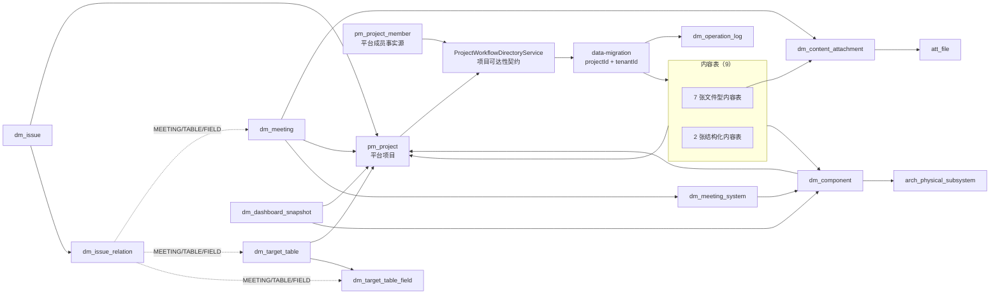
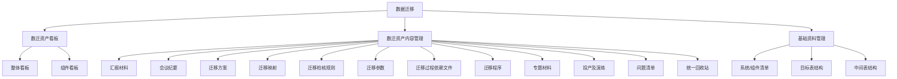

# 数据迁移模块数据库表结构与关系说明

> 需求：`REQ-20260820-031`
> 当前 DDL 基线：仓库 Flyway 迁移至 `V179`（系统关联统一为 `(project_id, system_code)` 指向 `dm_component`；审计表 `dm_operation_log` 带 `project_id` 项目维度；`dm_target_table`/`dm_target_table_field` 主键为业务编号 `table_code`/`field_code`；唯一键直接建在业务列上，软删行同样占用唯一名额；`dm_project` 已废弃删除）
> 系统关联口径（以本文档为准）：业务表一律以 `(project_id, system_code)` 关联当前项目 `dm_component` 活动清单，不保存、不依赖 `arch_physical_subsystem.id`
> 目标表/字段编号口径（以本文档为准）：`dm_target_table.table_code` 与 `dm_target_table_field.field_code` 即主键，编号由服务端生成（纯数字 `BIGINT`、全局唯一、单列主键，不按租户分区、不建号源表）；`dm_issue_relation.related_id` 与 `dm_operation_log.entity_id` 对目标表/字段直接存编号数值
> 适用范围：数据迁移模块当前运行模型、菜单功能、数据库关系和治理约束
> 数据口径：本地 MySQL 8.4 的 `information_schema` 与 `COUNT(*)` 复核；结构约束另经 data-migration 模块 MySQL 8.4 迁移测试断言复核；未连接生产环境

## 1. 当前模型概览

数据迁移模块采用“内容一菜单一表”的模型：7 张文件型内容表、2 张结构化内容表共享统一的租户、项目、组件、编号、负责人、软删除和审计字段；文件型内容通过公共附件关系表绑定平台附件。中间表结构与目标表共用 `dm_target_table` 主表和 `dm_target_table_field` 字段表，通过 `table_category='INTERMEDIATE'` 区分。会议和问题是独立实体，分别通过会议-系统关系表、问题关联表表达多对多或多态关系。

当前最终模型包含 19 张 `dm_` 表，不含 `dm_intermediate_table` 与已废弃删除的 `dm_project`。全部表为 InnoDB、`utf8mb4_unicode_ci`。项目主数据统一使用平台 `pm_project`。

项目成员与项目可达性由 `platform/system` 的公开契约 `com.ccb.system.capability.ProjectWorkflowDirectoryService` 提供。`pm_project_member` 是平台成员事实源，必须保留；数据迁移模块不直接查询或写入该表，也不复制成员判定 SQL。模块可以通过 `pm_project` 做项目名称投影和未删除状态过滤，但项目成员范围始终由平台契约决定。数据迁移服务只接收契约校验后的 `projectId`，所有业务查询和写入均绑定租户与项目。

## 2. 表清单

### 2.1 数据迁移模块自有表

| 分组 | 表名 | 列数 | 说明 | 本地总行数 | 活动行数 |
| --- | --- | ---: | --- | ---: | ---: |
| 内容·文件型 | `dm_report` | 17 | 汇报材料 | 0 | 0 |
| 内容·文件型 | `dm_plan` | 18 | 迁移方案 | 0 | 0 |
| 内容·文件型 | `dm_mapping_doc` | 14 | 迁移映射 | 0 | 0 |
| 内容·文件型 | `dm_dependency` | 14 | 迁移过程依赖文件 | 0 | 0 |
| 内容·文件型 | `dm_script` | 14 | 迁移程序 | 0 | 0 |
| 内容·文件型 | `dm_topic` | 14 | 专题材料 | 0 | 0 |
| 内容·文件型 | `dm_release_drill` | 14 | 投产及演练 | 0 | 0 |
| 内容·结构化 | `dm_rule` | 15 | 迁移检核规则，主体为 JSON | 0 | 0 |
| 内容·结构化 | `dm_parameter` | 15 | 迁移参数，主体为 JSON | 0 | 0 |
| 附件关系 | `dm_content_attachment` | 12 | 内容与平台附件的关系 | 0 | 0 |
| 独立实体 | `dm_meeting` | 18 | 会议纪要 | 0 | 0 |
| 独立实体 | `dm_meeting_system` | 7 | 会议与项目内系统/组件关系 | 0 | 不适用 |
| 独立实体 | `dm_issue` | 26 | 问题清单 | 0 | 0 |
| 独立实体 | `dm_issue_relation` | 7 | 问题与会议/表/字段关系 | 0 | 不适用 |
| 基础资料 | `dm_component` | 11 | 系统/组件清单 | 0 | 0 |
| 基础资料 | `dm_target_table` | 14 | 目标表及中间表主数据 | 0 | 0 |
| 基础资料 | `dm_target_table_field` | 19 | 目标表字段明细 | 0 | 0 |
| 运营支撑 | `dm_dashboard_snapshot` | 8 | 每日看板快照 | 0 | 不适用 |
| 运营支撑 | `dm_operation_log` | 11 | 模块写操作审计 | 0 | 不适用 |

活动行指 `deleted = 0`。快照、关系表和操作日志没有 `deleted` 列，不使用活动行统计。

### 2.2 关联使用的其他模块表

下表按“当前运行 SQL”“菜单/RBAC SQL”“平台契约内部事实源”区分，避免把平台表误认为数据迁移模块自有表。

| 所属模块 | 表 | 使用方式 | 数据迁移模块使用字段 |
| --- | --- | --- | --- |
| `platform/system` | `pm_project` | 列表展示项目名称、校验项目未删除；快照调度器统计项目数 | `id`, `tenant_id`, `project_name`, `deleted` |
| `platform/system` | `pm_project_member` | 仅由 `ProjectWorkflowDirectoryService` 间接使用，提供成员范围；模块无直接 SQL | `project_id`, `user_id`, `status`, `deleted`（契约内部） |
| `platform/system` | `pm_project_member_role`, `pm_project_role` | 平台契约解析项目角色；模块无直接 SQL | `member_id`, `role_id`, `project_id`, `role_code`（契约内部） |
| `business/architecture` | `arch_physical_subsystem` | 系统名称展示投影：业务关联统一以 `(project_id, system_code)` 指向 `dm_component`，需要名称时经 `dm_component` 按编号关联本表投影；不保存本表 `id` 引用 | `tenant_id`, `code`, `short_name`, `name`, `deleted` |
| `platform/attachment` | `att_file` | 附件关系的目标文件元数据 | `id`, `tenant_id`, `file_name`, `status`, `deleted_at` |
| `platform/system` | `sys_user` | 展示创建人、更新人、删除人 | `id`, `tenant_id`, `display_name`, `deleted` |
| `platform/system` | `sys_user_role` | 判断管理员角色 | `user_id`, `role_id`, `tenant_id` |
| `platform/system` | `sys_role` | 判断 `ADMIN`、`SUPER_ADMIN`、`DATA_MIGRATION_ADMIN` | `id`, `tenant_id`, `role_code`, `status`, `deleted` |
| `platform/system` | `sys_menu_permission` | 判断菜单动作权限 | `id`, `tenant_id`, `permission_code`, `action_code`, `status` |
| `platform/system` | `sys_role_permission` | 将动作权限授予角色 | `role_id`, `permission_id`, `tenant_id` |
| `platform/system` | `sys_menu` | 菜单种子与路由注册 SQL 使用 | `id`, `parent_id`, `route_path`, `permission_code`, `deleted` |
| `platform/system` | `sys_role_menu` | 菜单种子授权 SQL 使用 | `role_id`, `menu_id`, `tenant_id` |

`pm_project_member` 不得删除、重命名或由数据迁移模块替代。项目权限、项目角色、工作流人员解析统一由平台公开契约负责；业务模块不能复制成员判定 SQL。

## 3. 模块表字段信息

> 本节给出模块全部 19 张 `dm_` 表的完整列结构（字段、类型、默认/约束、说明），每张表一节，可直接单表核对；唯一键与索引见每节末尾“约束/索引”行，设计口径详见第 6 章。

### 3.1 内容表公共列（9 张内容表共性对照）

| 字段 | 类型 | 默认/约束 | 说明 |
| --- | --- | --- | --- |
| `id` | bigint | PK，自增 | 技术主键；仅用于记录定位、表间关联、附件绑定和审计，不作为业务编号展示或生成来源 |
| `tenant_id` | bigint | NOT NULL，默认 1 | 租户 ID |
| `project_id` | bigint | NOT NULL | 所属平台项目；所有列表和写操作的隔离键 |
| `component_id` | bigint | NULL | 所属组件，可空 |
| `doc_code` | varchar(96) | NOT NULL | 不可变业务编号；新建时由服务端生成，格式见下方规则；项目内唯一（含软删记录） |
| `doc_name` | varchar(255) | NOT NULL | 内容名称 |
| `owner_id` | bigint | NOT NULL | 负责人用户 ID |
| `deleted` | tinyint | NOT NULL，默认 0 | 逻辑删除标记 |
| `deleted_by` | bigint | NULL | 删除人 |
| `deleted_at` | timestamp | NULL | 删除时间 |
| `created_by` | bigint | NULL | 创建人 |
| `created_at` | timestamp | NOT NULL，默认 CURRENT_TIMESTAMP | 创建时间 |
| `updated_by` | bigint | NULL | 最后编辑人 |
| `updated_at` | timestamp | NOT NULL，默认 CURRENT_TIMESTAMP ON UPDATE | 最后更新时间 |

> 约束/索引：内容表编号唯一键统一为 `(tenant_id, project_id, doc_code)`（全行唯一，含软删记录）；下表仅作共性对照，3.2-3.10 各节已包含每张表的完整列清单。

`doc_code` 的唯一写入来源为 data-migration 模块内 `ContentDocCodeGenerator`。9 类前缀分别为：`PLAN`、`MAP`、`DEP`、`SCRIPT`、`TOPIC`、`DRILL`、`REPORT`、`RULE`、`PARAM`；完整格式为 `<前缀>-<32 位小写十六进制 UUID>`，UUID 段不含连字符，例如 `PLAN-550e8400e29b41d4a716446655440000`。

- 客户端表单、multipart 请求和结构化 Excel 导入不得提供或覆盖 `doc_code`/`assetCode`。
- 更新、按 `id` 替换文件、软删除、恢复和回收站操作均保留原 `doc_code`；`doc_code` 项目内唯一（含软删记录），删除后需彻底删除（purge）才能在同项目重建。
- `id` 与 `doc_code` 不重复承担同一职责：前者是内部技术定位值，后者是用户可见、可搜索和可导出的业务标识。

### 3.2 `dm_plan`（迁移方案，18 列）

| 字段 | 类型 | 默认/约束 | 说明 |
| --- | --- | --- | --- |
| `id` | bigint | PK，自增 | 内容主键 |
| `tenant_id` | bigint | NOT NULL，默认 1 | 租户 ID |
| `project_id` | bigint | NOT NULL | 所属平台项目；所有列表和写操作的隔离键 |
| `component_id` | bigint | NULL | 所属组件，可空 |
| `granularity` | varchar(16) | NOT NULL，默认 `PROJECT` | `PROJECT` 项目级或 `SYSTEM` 系统级 |
| `plan_type` | varchar(16) | NOT NULL，默认 `DATA` | `BUSINESS` 业务迁移方案或 `DATA` 数据迁移方案 |
| `system_code` | varchar(64) | NOT NULL，默认 '' | 关联系统（当前项目 `dm_component` 活动记录的编号），项目级使用空串哨兵 |
| `plan_summary` | varchar(1000) | NULL | 方案简介 |
| `doc_code` | varchar(96) | NOT NULL | 内容编号；项目内唯一（含软删记录） |
| `doc_name` | varchar(255) | NOT NULL | 内容名称 |
| `owner_id` | bigint | NOT NULL | 负责人用户 ID |
| `deleted` | tinyint | NOT NULL，默认 0 | 逻辑删除标记 |
| `deleted_by` | bigint | NULL | 删除人 |
| `deleted_at` | timestamp | NULL | 删除时间 |
| `created_by` | bigint | NULL | 创建人 |
| `created_at` | timestamp | NOT NULL，默认 CURRENT_TIMESTAMP | 创建时间 |
| `updated_by` | bigint | NULL | 最后编辑人 |
| `updated_at` | timestamp | NOT NULL，默认 CURRENT_TIMESTAMP ON UPDATE | 最后更新时间 |

> 约束/索引：`uk_dm_plan_code (tenant_id, project_id, doc_code)`；`uk_dm_plan_dimension (tenant_id, project_id, granularity, plan_type, system_code)`；`idx_dm_plan_query (tenant_id, project_id, deleted, updated_at)`；`idx_dm_plan_owner (tenant_id, owner_id, deleted)`；`idx_dm_plan_dimension (tenant_id, project_id, granularity, plan_type, deleted)`；`idx_dm_plan_system (tenant_id, project_id, system_code, deleted)`

### 3.3 `dm_mapping_doc`（迁移映射，15 列）

| 字段 | 类型 | 默认/约束 | 说明 |
| --- | --- | --- | --- |
| `id` | bigint | PK，自增 | 内容主键 |
| `tenant_id` | bigint | NOT NULL，默认 1 | 租户 ID |
| `project_id` | bigint | NOT NULL | 所属平台项目；所有列表和写操作的隔离键 |
| `component_id` | bigint | NULL | 所属组件，可空 |
| `doc_code` | varchar(96) | NOT NULL | 映射编号；项目内唯一（含软删记录） |
| `doc_name` | varchar(255) | NOT NULL | 映射名称 |
| `owner_id` | bigint | NOT NULL | 负责人用户 ID |
| `deleted` | tinyint | NOT NULL，默认 0 | 逻辑删除标记 |
| `deleted_by` | bigint | NULL | 删除人 |
| `deleted_at` | timestamp | NULL | 删除时间 |
| `created_by` | bigint | NULL | 创建人 |
| `created_at` | timestamp | NOT NULL，默认 CURRENT_TIMESTAMP | 创建时间 |
| `updated_by` | bigint | NULL | 最后编辑人 |
| `updated_at` | timestamp | NOT NULL，默认 CURRENT_TIMESTAMP ON UPDATE | 最后更新时间 |

> 约束/索引：`uk_dm_mapping_doc_code (tenant_id, project_id, doc_code)`；`idx_dm_mapping_doc_query (tenant_id, project_id, deleted, updated_at)`；`idx_dm_mapping_doc_owner (tenant_id, owner_id, deleted)`

### 3.4 `dm_dependency`（迁移过程依赖文件，15 列）

| 字段 | 类型 | 默认/约束 | 说明 |
| --- | --- | --- | --- |
| `id` | bigint | PK，自增 | 内容主键 |
| `tenant_id` | bigint | NOT NULL，默认 1 | 租户 ID |
| `project_id` | bigint | NOT NULL | 所属平台项目；所有列表和写操作的隔离键 |
| `component_id` | bigint | NULL | 所属组件，可空 |
| `doc_code` | varchar(96) | NOT NULL | 文件编号；项目内唯一（含软删记录） |
| `doc_name` | varchar(255) | NOT NULL | 文件名称 |
| `owner_id` | bigint | NOT NULL | 负责人用户 ID |
| `deleted` | tinyint | NOT NULL，默认 0 | 逻辑删除标记 |
| `deleted_by` | bigint | NULL | 删除人 |
| `deleted_at` | timestamp | NULL | 删除时间 |
| `created_by` | bigint | NULL | 创建人 |
| `created_at` | timestamp | NOT NULL，默认 CURRENT_TIMESTAMP | 创建时间 |
| `updated_by` | bigint | NULL | 最后编辑人 |
| `updated_at` | timestamp | NOT NULL，默认 CURRENT_TIMESTAMP ON UPDATE | 最后更新时间 |

> 约束/索引：`uk_dm_dependency_code (tenant_id, project_id, doc_code)`；`idx_dm_dependency_query (tenant_id, project_id, deleted, updated_at)`；`idx_dm_dependency_owner (tenant_id, owner_id, deleted)`

### 3.5 `dm_script`（迁移程序，15 列）

| 字段 | 类型 | 默认/约束 | 说明 |
| --- | --- | --- | --- |
| `id` | bigint | PK，自增 | 内容主键 |
| `tenant_id` | bigint | NOT NULL，默认 1 | 租户 ID |
| `project_id` | bigint | NOT NULL | 所属平台项目；所有列表和写操作的隔离键 |
| `component_id` | bigint | NULL | 所属组件，可空 |
| `doc_code` | varchar(96) | NOT NULL | 程序编号；项目内唯一（含软删记录） |
| `doc_name` | varchar(255) | NOT NULL | 程序名称 |
| `owner_id` | bigint | NOT NULL | 负责人用户 ID |
| `deleted` | tinyint | NOT NULL，默认 0 | 逻辑删除标记 |
| `deleted_by` | bigint | NULL | 删除人 |
| `deleted_at` | timestamp | NULL | 删除时间 |
| `created_by` | bigint | NULL | 创建人 |
| `created_at` | timestamp | NOT NULL，默认 CURRENT_TIMESTAMP | 创建时间 |
| `updated_by` | bigint | NULL | 最后编辑人 |
| `updated_at` | timestamp | NOT NULL，默认 CURRENT_TIMESTAMP ON UPDATE | 最后更新时间 |

> 约束/索引：`uk_dm_script_code (tenant_id, project_id, doc_code)`；`idx_dm_script_query (tenant_id, project_id, deleted, updated_at)`；`idx_dm_script_owner (tenant_id, owner_id, deleted)`

### 3.6 `dm_topic`（专题材料，15 列）

| 字段 | 类型 | 默认/约束 | 说明 |
| --- | --- | --- | --- |
| `id` | bigint | PK，自增 | 内容主键 |
| `tenant_id` | bigint | NOT NULL，默认 1 | 租户 ID |
| `project_id` | bigint | NOT NULL | 所属平台项目；所有列表和写操作的隔离键 |
| `component_id` | bigint | NULL | 所属组件，可空 |
| `doc_code` | varchar(96) | NOT NULL | 材料编号；项目内唯一（含软删记录） |
| `doc_name` | varchar(255) | NOT NULL | 材料名称 |
| `owner_id` | bigint | NOT NULL | 负责人用户 ID |
| `deleted` | tinyint | NOT NULL，默认 0 | 逻辑删除标记 |
| `deleted_by` | bigint | NULL | 删除人 |
| `deleted_at` | timestamp | NULL | 删除时间 |
| `created_by` | bigint | NULL | 创建人 |
| `created_at` | timestamp | NOT NULL，默认 CURRENT_TIMESTAMP | 创建时间 |
| `updated_by` | bigint | NULL | 最后编辑人 |
| `updated_at` | timestamp | NOT NULL，默认 CURRENT_TIMESTAMP ON UPDATE | 最后更新时间 |

> 约束/索引：`uk_dm_topic_code (tenant_id, project_id, doc_code)`；`idx_dm_topic_query (tenant_id, project_id, deleted, updated_at)`；`idx_dm_topic_owner (tenant_id, owner_id, deleted)`

### 3.7 `dm_release_drill`（投产及演练，15 列）

| 字段 | 类型 | 默认/约束 | 说明 |
| --- | --- | --- | --- |
| `id` | bigint | PK，自增 | 内容主键 |
| `tenant_id` | bigint | NOT NULL，默认 1 | 租户 ID |
| `project_id` | bigint | NOT NULL | 所属平台项目；所有列表和写操作的隔离键 |
| `component_id` | bigint | NULL | 所属组件，可空 |
| `doc_code` | varchar(96) | NOT NULL | 材料编号；项目内唯一（含软删记录） |
| `doc_name` | varchar(255) | NOT NULL | 材料名称 |
| `owner_id` | bigint | NOT NULL | 负责人用户 ID |
| `deleted` | tinyint | NOT NULL，默认 0 | 逻辑删除标记 |
| `deleted_by` | bigint | NULL | 删除人 |
| `deleted_at` | timestamp | NULL | 删除时间 |
| `created_by` | bigint | NULL | 创建人 |
| `created_at` | timestamp | NOT NULL，默认 CURRENT_TIMESTAMP | 创建时间 |
| `updated_by` | bigint | NULL | 最后编辑人 |
| `updated_at` | timestamp | NOT NULL，默认 CURRENT_TIMESTAMP ON UPDATE | 最后更新时间 |

> 约束/索引：`uk_dm_release_drill_code (tenant_id, project_id, doc_code)`；`idx_dm_release_drill_query (tenant_id, project_id, deleted, updated_at)`；`idx_dm_release_drill_owner (tenant_id, owner_id, deleted)`

### 3.8 `dm_report`（汇报材料，18 列）

| 字段 | 类型 | 默认/约束 | 说明 |
| --- | --- | --- | --- |
| `id` | bigint | PK，自增 | 内容主键 |
| `tenant_id` | bigint | NOT NULL，默认 1 | 租户 ID |
| `project_id` | bigint | NOT NULL | 所属平台项目；所有列表和写操作的隔离键 |
| `component_id` | bigint | NULL | 所属组件，可空 |
| `report_period` | varchar(16) | NULL | 汇报周期 |
| `report_date` | date | NULL | 汇报日期 |
| `keywords` | varchar(500) | NULL | 关键字，逗号分隔 |
| `doc_code` | varchar(96) | NOT NULL | 内容编号；项目内唯一（含软删记录） |
| `doc_name` | varchar(255) | NOT NULL | 内容名称 |
| `owner_id` | bigint | NOT NULL | 负责人用户 ID |
| `deleted` | tinyint | NOT NULL，默认 0 | 逻辑删除标记 |
| `deleted_by` | bigint | NULL | 删除人 |
| `deleted_at` | timestamp | NULL | 删除时间 |
| `created_by` | bigint | NULL | 创建人 |
| `created_at` | timestamp | NOT NULL，默认 CURRENT_TIMESTAMP | 创建时间 |
| `updated_by` | bigint | NULL | 最后编辑人 |
| `updated_at` | timestamp | NOT NULL，默认 CURRENT_TIMESTAMP ON UPDATE | 最后更新时间 |

> 约束/索引：`uk_dm_report_code (tenant_id, project_id, doc_code)`；`idx_dm_report_query (tenant_id, project_id, deleted, updated_at)`；`idx_dm_report_period (tenant_id, project_id, report_period, deleted)`；`idx_dm_report_owner (tenant_id, owner_id, deleted)`

### 3.9 `dm_rule`（迁移检核规则，15 列）

| 字段 | 类型 | 默认/约束 | 说明 |
| --- | --- | --- | --- |
| `id` | bigint | PK，自增 | 内容主键 |
| `tenant_id` | bigint | NOT NULL，默认 1 | 租户 ID |
| `project_id` | bigint | NOT NULL | 所属平台项目；所有列表和写操作的隔离键 |
| `component_id` | bigint | NULL | 所属组件，可空 |
| `doc_code` | varchar(96) | NOT NULL | 规则编号；项目内唯一（含软删记录） |
| `doc_name` | varchar(255) | NOT NULL | 规则名称 |
| `owner_id` | bigint | NOT NULL | 负责人用户 ID |
| `deleted` | tinyint | NOT NULL，默认 0 | 逻辑删除标记 |
| `deleted_by` | bigint | NULL | 删除人 |
| `deleted_at` | timestamp | NULL | 删除时间 |
| `created_by` | bigint | NULL | 创建人 |
| `created_at` | timestamp | NOT NULL，默认 CURRENT_TIMESTAMP | 创建时间 |
| `updated_by` | bigint | NULL | 最后编辑人 |
| `updated_at` | timestamp | NOT NULL，默认 CURRENT_TIMESTAMP ON UPDATE | 最后更新时间 |
| `structured_data` | json | NOT NULL | 结构化主体数据 |

> 约束/索引：`uk_dm_rule_code (tenant_id, project_id, doc_code)`；`idx_dm_rule_query (tenant_id, project_id, deleted, updated_at)`；`idx_dm_rule_owner (tenant_id, owner_id, deleted)`

### 3.10 `dm_parameter`（迁移参数，15 列）

| 字段 | 类型 | 默认/约束 | 说明 |
| --- | --- | --- | --- |
| `id` | bigint | PK，自增 | 内容主键 |
| `tenant_id` | bigint | NOT NULL，默认 1 | 租户 ID |
| `project_id` | bigint | NOT NULL | 所属平台项目；所有列表和写操作的隔离键 |
| `component_id` | bigint | NULL | 所属组件，可空 |
| `doc_code` | varchar(96) | NOT NULL | 参数编号；项目内唯一（含软删记录） |
| `doc_name` | varchar(255) | NOT NULL | 参数名称 |
| `owner_id` | bigint | NOT NULL | 负责人用户 ID |
| `deleted` | tinyint | NOT NULL，默认 0 | 逻辑删除标记 |
| `deleted_by` | bigint | NULL | 删除人 |
| `deleted_at` | timestamp | NULL | 删除时间 |
| `created_by` | bigint | NULL | 创建人 |
| `created_at` | timestamp | NOT NULL，默认 CURRENT_TIMESTAMP | 创建时间 |
| `updated_by` | bigint | NULL | 最后编辑人 |
| `updated_at` | timestamp | NOT NULL，默认 CURRENT_TIMESTAMP ON UPDATE | 最后更新时间 |
| `structured_data` | json | NOT NULL | 结构化主体数据 |

> 约束/索引：`uk_dm_parameter_code (tenant_id, project_id, doc_code)`；`idx_dm_parameter_query (tenant_id, project_id, deleted, updated_at)`；`idx_dm_parameter_owner (tenant_id, owner_id, deleted)`

### 3.11 `dm_content_attachment`（内容公共附件关系，12 列）

| 字段 | 类型 | 默认/约束 | 说明 |
| --- | --- | --- | --- |
| `id` | bigint | PK，自增 | 关系主键 |
| `tenant_id` | bigint | NOT NULL，默认 1 | 租户 ID |
| `business_type` | varchar(32) | NOT NULL | `PLAN`/`MAPPING_DOC`/`DEPENDENCY`/`SCRIPT`/`TOPIC`/`RELEASE_DRILL`/`REPORT`/`MEETING` |
| `business_id` | bigint | NOT NULL | 业务实体 ID，由 `business_type` 解释 |
| `attachment_id` | bigint | NOT NULL | `att_file.id` |
| `file_name` | varchar(500) | NOT NULL | 附件原始文件名 |
| `sort_order` | int | NOT NULL，默认 0 | 附件顺序，主文件为 0 |
| `deleted` | tinyint(1) | NOT NULL，默认 0 | 附件关系软删除 |
| `deleted_by` | bigint | NULL | 删除人 |
| `deleted_at` | datetime(6) | NULL | 删除时间 |
| `created_by` | bigint | NOT NULL | 创建人 |
| `created_at` | datetime(6) | NOT NULL，默认 CURRENT_TIMESTAMP(6) | 创建时间 |

> 约束/索引：`uk_dm_content_att (tenant_id, business_type, business_id, attachment_id)`；`idx_dm_content_att_business (tenant_id, business_type, business_id, deleted, sort_order)`；`idx_dm_content_att_attachment (tenant_id, attachment_id, deleted)`；`idx_dm_content_att_tenant (tenant_id, deleted)`

### 3.12 `dm_meeting`（会议纪要，18 列）

| 字段 | 类型 | 默认/约束 | 说明 |
| --- | --- | --- | --- |
| `meeting_id` | bigint | PK，自增 | 会议主键 |
| `tenant_id` | bigint | NOT NULL | 租户 ID |
| `project_id` | bigint | NOT NULL | 所属项目 |
| `meeting_code` | varchar(96) | NOT NULL | 会议编号，项目内唯一（含软删记录） |
| `granularity` | varchar(50) | NOT NULL | `PROJECT`/`COMPONENT`/`TABLE`/`FIELD` |
| `meeting_source` | varchar(50) | NOT NULL | `MEETING_MINUTES`/`ISSUE_EXTRACT` |
| `meeting_title` | varchar(500) | NOT NULL | 会议主题 |
| `meeting_content` | text | NULL | 会议内容 |
| `meeting_conclusion` | text | NULL | 会议结论 |
| `business_scenario` | varchar(500) | NULL | 业务场景 |
| `keywords` | json | NULL | JSON 关键字数组 |
| `deleted` | tinyint(1) | NOT NULL，默认 0 | 逻辑删除 |
| `deleted_by` | bigint | NULL | 删除人 |
| `deleted_at` | datetime(6) | NULL | 删除时间 |
| `created_by` | bigint | NOT NULL | 创建人 |
| `created_at` | datetime(6) | NOT NULL，默认 CURRENT_TIMESTAMP(6) | 创建时间 |
| `updated_by` | bigint | NULL | 更新人 |
| `updated_at` | datetime(6) | NULL，ON UPDATE CURRENT_TIMESTAMP(6) | 更新时间 |

> 约束/索引：`uk_dm_meeting_code (tenant_id, project_id, meeting_code)`；`idx_dm_meeting_code (tenant_id, meeting_code)`；`idx_dm_meeting_project (tenant_id, project_id, deleted, updated_at)`；`idx_dm_meeting_source (tenant_id, meeting_source, deleted)`；`idx_dm_meeting_granularity (tenant_id, granularity, deleted)`；`idx_dm_meeting_created (tenant_id, created_at)`；`idx_dm_meeting_deleted (tenant_id, deleted, deleted_at)`

### 3.13 `dm_meeting_system`（会议与项目内系统/组件关系，7 列）

| 字段 | 类型 | 默认/约束 | 说明 |
| --- | --- | --- | --- |
| `id` | bigint | PK，自增 | 关系主键 |
| `tenant_id` | bigint | NOT NULL，默认 1 | 租户 ID |
| `meeting_id` | bigint | NOT NULL | `dm_meeting.meeting_id` |
| `project_id` | bigint | NOT NULL，默认 0 | 所属项目，与 `dm_meeting.project_id` 一致 |
| `system_code` | varchar(64) | NOT NULL，默认 '' | 项目内系统编号（`dm_component` 活动记录），须在当前租户、项目内存在 |
| `created_by` | bigint | NOT NULL | 创建人 |
| `created_at` | timestamp | NOT NULL，默认 CURRENT_TIMESTAMP | 创建时间 |

> 约束/索引：`uk_dm_meeting_system (tenant_id, meeting_id, system_code)`；`idx_dm_meeting_system_project (tenant_id, project_id, system_code)`；关系表无软删除

### 3.14 `dm_issue`（问题清单，26 列）

| 字段 | 类型 | 默认/约束 | 说明 |
| --- | --- | --- | --- |
| `id` | bigint | PK | 问题主键 |
| `tenant_id` | bigint | NOT NULL，默认 1 | 租户 ID |
| `project_id` | bigint | NOT NULL | 所属项目 |
| `issue_code` | varchar(96) | NOT NULL | 问题编号，项目内唯一（含软删记录） |
| `issue_name` | varchar(255) | NOT NULL | 问题名称 |
| `granularity` | varchar(16) | NULL | `PROJECT`/`COMPONENT`/`TABLE`/`FIELD` |
| `system_code` | varchar(96) | NULL | 项目内系统编号（当前项目 `dm_component` 活动记录的编号），录入/显示键；不保存 `arch_physical_subsystem.id` |
| `issue_source` | varchar(32) | NULL | 问题来源 |
| `defect_type` | varchar(32) | NULL | 缺陷类型 |
| `issue_description` | text | NULL | 问题描述 |
| `solution` | text | NULL | 解决方案 |
| `meeting_conclusion` | text | NULL | 会议结论 |
| `processing_steps` | text | NULL | 处理步骤 |
| `business_scenario` | varchar(500) | NULL | 业务场景 |
| `handler` | varchar(160) | NULL | 处理人文本 |
| `responsible_party` | varchar(160) | NULL | 责任方文本 |
| `keywords` | varchar(500) | NULL | 逗号分隔关键字 |
| `frequency` | varchar(16) | NULL | 发生频率 |
| `owner_id` | bigint | NOT NULL | 负责人 |
| `deleted` | tinyint | NOT NULL，默认 0 | 逻辑删除 |
| `deleted_by` | bigint | NULL | 删除人 |
| `deleted_at` | timestamp | NULL | 删除时间 |
| `created_by` | bigint | NULL | 创建人 |
| `created_at` | timestamp | NOT NULL，默认 CURRENT_TIMESTAMP | 创建时间 |
| `updated_by` | bigint | NULL | 最后编辑人 |
| `updated_at` | timestamp | NOT NULL，默认 CURRENT_TIMESTAMP ON UPDATE | 最后更新时间 |

> 约束/索引：`uk_dm_issue_code (tenant_id, project_id, issue_code)`；`idx_dm_issue_query (tenant_id, project_id, deleted, updated_at)`；`idx_dm_issue_owner (tenant_id, owner_id, deleted)`；`idx_dm_issue_filters (tenant_id, project_id, granularity, issue_source, defect_type, frequency, deleted)`；`idx_dm_issue_system (tenant_id, project_id, system_code, deleted)`

### 3.15 `dm_issue_relation`（问题关联关系，7 列）

| 字段 | 类型 | 默认/约束 | 说明 |
| --- | --- | --- | --- |
| `id` | bigint | PK，自增 | 关系主键 |
| `tenant_id` | bigint | NOT NULL，默认 1 | 租户 ID |
| `issue_id` | bigint | NOT NULL | `dm_issue.id` |
| `related_type` | varchar(32) | NOT NULL | `MEETING`/`TABLE`/`FIELD` |
| `related_id` | bigint | NOT NULL | 由类型解释为会议编号（`dm_meeting.meeting_id`）、目标表编号（`dm_target_table.table_code`）或目标字段编号（`dm_target_table_field.field_code`） |
| `created_by` | bigint | NOT NULL | 创建人 |
| `created_at` | timestamp | NOT NULL，默认 CURRENT_TIMESTAMP | 创建时间 |

> 约束/索引：`uk_dm_issue_relation (tenant_id, issue_id, related_type, related_id)`；`idx_dm_issue_relation_target (tenant_id, related_type, related_id)`；关系表无软删除，硬删全量重插

### 3.16 `dm_component`（系统/组件清单，11 列）

| 字段 | 类型 | 默认/约束 | 说明 |
| --- | --- | --- | --- |
| `id` | bigint | PK，自增 | 组件主键 |
| `tenant_id` | bigint | NOT NULL，默认 1 | 租户 ID |
| `project_id` | bigint | NOT NULL | 所属项目 |
| `owner_id` | bigint | NOT NULL | 负责人 |
| `physical_subsystem_code` | varchar(64) | NULL | 系统编号，项目内唯一（含软删记录），跨表关联系统的统一业务键；系统名称展示经本表按编号投影 `arch_physical_subsystem` |
| `total_check` | tinyint | NOT NULL，默认 0 | 是否涉及总分核对，0 否、1 是 |
| `deleted` | tinyint | NOT NULL，默认 0 | 逻辑删除 |
| `created_at` | timestamp | NOT NULL，默认 CURRENT_TIMESTAMP | 创建时间 |
| `created_by` | bigint | NULL | 创建人 |
| `updated_at` | timestamp | NOT NULL，默认 CURRENT_TIMESTAMP ON UPDATE | 最后更新时间 |
| `updated_by` | bigint | NULL | 最后编辑人 |

> 约束/索引：`uk_dm_component_subsystem (tenant_id, project_id, physical_subsystem_code)`；`idx_dm_component_project (tenant_id, project_id, deleted)`；`idx_dm_component_list (tenant_id, project_id, deleted, updated_at)`

### 3.17 `dm_target_table`（目标表及中间表主数据，14 列）

| 字段 | 类型 | 默认/约束 | 说明 |
| --- | --- | --- | --- |
| `tenant_id` | bigint | NOT NULL，默认 1 | 租户 ID |
| `table_code` | bigint | PK | 表主键业务编号，服务端生成（纯数字 `BIGINT`、全局唯一、单列主键，不按租户分区），删除重建编号不复用 |
| `project_id` | bigint | NOT NULL | 所属项目 |
| `system_code` | varchar(64) | NOT NULL | 项目内系统编号（当前项目 `dm_component` 活动记录的编号），录入/显示键 |
| `table_name_en` | varchar(128) | NOT NULL | 表英文名，无空格 |
| `table_name_cn` | varchar(128) | NOT NULL | 表中文名，无空格 |
| `table_meaning` | varchar(500) | NULL | 表含义 |
| `table_category` | varchar(16) | NOT NULL，默认 `TARGET` | `TARGET` 或 `INTERMEDIATE` |
| `owner_id` | bigint | NOT NULL | 负责人 |
| `created_at` | timestamp | NOT NULL，默认 CURRENT_TIMESTAMP | 创建时间 |
| `created_by` | bigint | NULL | 创建人 |
| `updated_at` | timestamp | NOT NULL，默认 CURRENT_TIMESTAMP ON UPDATE | 更新时间 |
| `updated_by` | bigint | NULL | 更新人 |
| `deleted` | tinyint | NOT NULL，默认 0 | 逻辑删除 |

> 约束/索引：主键 `table_code`；`uk_target_table_tenant_code (tenant_id, table_code)`（租户组合唯一，兼作组合外键引用目标）；`uk_target_table_en (tenant_id, project_id, system_code, table_name_en)`；`uk_target_table_cn (tenant_id, project_id, system_code, table_name_cn)`；`idx_target_table_list (tenant_id, project_id, system_code, deleted, updated_at)`；`idx_target_table_category (tenant_id, table_category, deleted)`

### 3.18 `dm_target_table_field`（目标表字段明细，19 列）

| 字段 | 类型 | 默认/约束 | 说明 |
| --- | --- | --- | --- |
| `tenant_id` | bigint | NOT NULL，默认 1 | 租户 ID |
| `field_code` | bigint | PK | 字段主键业务编号，服务端生成（纯数字 `BIGINT`、全局唯一、单列主键，不按租户分区），删除重建编号不复用 |
| `table_code` | bigint | NOT NULL，组合外键 | 所属目标表编号 `dm_target_table.table_code` |
| `field_name_en` | varchar(128) | NOT NULL | 英文名，无空格 |
| `field_name_cn` | varchar(128) | NOT NULL | 中文名，无空格 |
| `field_meaning` | varchar(500) | NULL | 字段含义 |
| `code_description` | varchar(500) | NULL | 码值说明 |
| `is_key_field` | tinyint | NOT NULL，默认 0 | 是否关键栏位，0 否、1 是 |
| `oracle_type` | varchar(64) | NULL | ORACLE 字段类型 |
| `mysql_type` | varchar(64) | NULL | MySQL 字段类型 |
| `is_nullable` | tinyint | NOT NULL，默认 1 | 是否可空，0 否、1 是 |
| `is_primary_key` | tinyint | NOT NULL，默认 0 | 是否主键，0 否、1 是 |
| `dict_code` | varchar(64) | NULL | 数据字典编号，无空格 |
| `owner_id` | bigint | NOT NULL | 负责人 |
| `created_at` | timestamp | NOT NULL，默认 CURRENT_TIMESTAMP | 创建时间 |
| `created_by` | bigint | NULL | 创建人 |
| `updated_at` | timestamp | NOT NULL，默认 CURRENT_TIMESTAMP ON UPDATE | 更新时间 |
| `updated_by` | bigint | NULL | 更新人 |
| `deleted` | tinyint | NOT NULL，默认 0 | 逻辑删除 |

> 约束/索引：主键 `field_code`；`uk_target_field_en (tenant_id, table_code, field_name_en)`；`uk_target_field_cn (tenant_id, table_code, field_name_cn)`；`idx_target_field_table (tenant_id, table_code, deleted)`；`idx_target_field_key (tenant_id, table_code, is_key_field, deleted)`；`idx_target_field_dict (tenant_id, dict_code, deleted)`；组合物理外键 `fk_target_field_table_code ((tenant_id, table_code) → dm_target_table (tenant_id, table_code))`

### 3.19 `dm_dashboard_snapshot`（看板快照，8 列）

| 字段 | 类型 | 默认/约束 | 说明 |
| --- | --- | --- | --- |
| `id` | bigint | PK，自增 | 快照主键 |
| `tenant_id` | bigint | NOT NULL，默认 1 | 租户 ID |
| `snapshot_date` | date | NOT NULL | 快照日期 |
| `project_id` | bigint | NULL | 项目维度，可空 |
| `component_id` | bigint | NULL | 组件维度，可空 |
| `metric_code` | varchar(64) | NOT NULL | 指标编码 |
| `metric_value` | decimal(20,4) | NOT NULL，默认 0 | 指标值 |
| `created_at` | timestamp | NOT NULL，默认 CURRENT_TIMESTAMP | 创建时间 |

> 约束/索引：`uk_dm_snapshot (tenant_id, snapshot_date, project_id, component_id, metric_code)`

### 3.20 `dm_operation_log`（模块写操作审计，11 列）

| 字段 | 类型 | 默认/约束 | 说明 |
| --- | --- | --- | --- |
| `id` | bigint | PK，自增 | 审计主键 |
| `tenant_id` | bigint | NOT NULL，默认 1 | 租户 ID |
| `project_id` | bigint | NOT NULL，默认 0 | 操作实体归属项目；清空回收站类操作记录操作范围项目 |
| `actor_id` | bigint | NOT NULL | 操作人 |
| `operation_code` | varchar(64) | NOT NULL | 操作码 |
| `entity_type` | varchar(64) | NOT NULL | 实体类型 |
| `entity_id` | bigint | NULL | 实体业务编号（目标表/字段即 `table_code`/`field_code` 数值） |
| `result_code` | varchar(16) | NOT NULL，默认 `SUCCESS` | `SUCCESS`/`FAIL` |
| `trace_id` | varchar(64) | NULL | 链路追踪 ID |
| `detail_json` | json | NULL | 操作详情 |
| `created_at` | timestamp | NOT NULL，默认 CURRENT_TIMESTAMP | 创建时间 |

> 约束/索引：`idx_dm_operation_log (tenant_id, created_at, actor_id)`；项目级审计查询索引 `idx_dm_operation_log_project (tenant_id, project_id, entity_type, created_at)`

## 4. 表关系整体视图

除 `dm_target_table_field` 按 `(tenant_id, table_code)` 引用 `dm_target_table` 的组合物理外键外，图中关系均由服务层通过租户、项目、删除状态和业务类型校验实现，不建立跨模块物理外键。

### 4.1 关系规则

| 关系 | 基数/约束 | 实现方式 |
| --- | --- | --- |
| 项目 → 内容、会议、问题、组件、目标表 | 一对多 | `project_id` + 平台项目可达性契约 |
| 组件 → 内容 | 一对多，可空 | `component_id`，看板统计时限定活动行 |
| 目标表 → 字段 | 一对多 | `dm_target_table_field (tenant_id, table_code)` 组合物理外键，引用 `dm_target_table (tenant_id, table_code)` |
| 内容/会议 → 附件 | 一对多 | `business_type + business_id` 多态关系 |
| 会议 ↔ 项目内系统/组件 | 多对多 | `dm_meeting_system`，按 `(project_id, system_code)` 关联 `dm_component` 活动行 |
| 问题 → 会议/目标表/字段 | 一对多多态 | `related_type + related_id` |
| 组件/目标表/问题 → 项目内系统/组件 | 多对一，可空 | 按 `(project_id, system_code)` 关联 `dm_component` 活动行，只维护编号不保存 `arch_physical_subsystem.id` |
| 内容 → 系统/组件 | 可选投影 | 方案、问题、目标表按 `(project_id, system_code)` 关联；会议经 `dm_meeting_system`；名称经 `dm_component` 投影 |
| 任意业务实体 → 操作日志 | 一对多多态 | `entity_type + entity_id` |

## 5. 按菜单功能的表关系视图

### 5.1 菜单树

### 5.2 菜单与表映射

| 菜单/路由 | 服务入口 | 直接使用的模块表 | 关联表与用途 |
| --- | --- | --- | --- |
| 整体看板 `/data-migration/dashboard/overall` | `DashboardService.overall` | 9 张内容表、`dm_component` | 平台契约提供可访问项目数；实时统计活动内容，不读取快照 |
| 组件看板 `/data-migration/dashboard/components` | `DashboardService.component` | `dm_component`、9 张内容表 | 跨 9 张内容表一次 `UNION ALL` 按组件分组统计，系统名称经 `dm_component` 按编号投影 `arch_physical_subsystem` 显示 |
| 汇报材料 `/data-migration/content/reports` | `ReportService` | `dm_report`、`dm_content_attachment`、`dm_operation_log` | 文件元数据、附件绑定和审计，重复内容按普通文件处理 |
| 会议纪要 `/data-migration/content/meetings` | `MeetingService` | `dm_meeting`、`dm_meeting_system`、`dm_content_attachment`、`dm_issue_relation` | 关联项目内系统/组件、问题和会议附件；附件回收站在会议页内 |
| 迁移方案 `/data-migration/content/plans` | `PlanService` | `dm_plan`、`dm_content_attachment`、`dm_operation_log` | 项目/系统颗粒度和方案类型维度唯一 |
| 迁移映射 `/data-migration/content/mappings` | `ContentFileAssetService(MAPPING_DOC)` | `dm_mapping_doc`、`dm_content_attachment`、`dm_operation_log` | 文件型内容 |
| 迁移检核规则 `/data-migration/content/validation-rules` | `StructuredAssetService(RULE)` | `dm_rule`、`dm_operation_log` | JSON 结构化主体 |
| 迁移参数 `/data-migration/content/parameters` | `StructuredAssetService(PARAMETER)` | `dm_parameter`、`dm_operation_log` | JSON 主体，支持 Excel 导入导出 |
| 迁移过程依赖文件 `/data-migration/content/dependencies` | `ContentFileAssetService(DEPENDENCY)` | `dm_dependency`、`dm_content_attachment`、`dm_operation_log` | 文件型内容 |
| 迁移程序 `/data-migration/content/programs` | `ContentFileAssetService(SCRIPT)` | `dm_script`、`dm_content_attachment`、`dm_operation_log` | 文件型内容 |
| 专题材料 `/data-migration/content/topics` | `ContentFileAssetService(TOPIC)` | `dm_topic`、`dm_content_attachment`、`dm_operation_log` | 文件型内容 |
| 投产及演练 `/data-migration/content/release-drills` | `ContentFileAssetService(RELEASE_DRILL)` | `dm_release_drill`、`dm_content_attachment`、`dm_operation_log` | 文件型内容 |
| 问题清单 `/data-migration/content/issues` | `IssueService`、`IssueExcelService` | `dm_issue`、`dm_issue_relation`、`dm_operation_log` | 关联目标为 `dm_meeting`、`dm_target_table`、`dm_target_table_field` |
| 统一回收站 `/data-migration/content/recycle-bin` | `ContentRecycleBinService` | 9 张内容表、`dm_content_attachment`、`dm_meeting` | 按项目分页；恢复和彻底删除委派来源服务 |
| 系统/组件清单 `/data-migration/base/components` | `ProjectComponentService` | `dm_component`、9 张内容表、`dm_operation_log` | 系统名称经 `arch_physical_subsystem` 按编号投影，关联以项目内 `physical_subsystem_code` 为唯一键 |
| 目标表结构 `/data-migration/base/target-tables` | `TargetTableService(category=TARGET)` | `dm_target_table`、`dm_target_table_field`、`dm_operation_log` | 主表与字段一对多 |
| 中间表结构 `/data-migration/base/intermediate-tables` | `TargetTableService(category=INTERMEDIATE)` | `dm_target_table`、`dm_target_table_field`、`dm_operation_log` | 通过 `table_category='INTERMEDIATE'` 复用目标表结构主从模型 |

统一回收站的文档级来源包括文件型内容、结构化内容、方案、汇报材料和会议；问题清单保留独立问题回收站端点。所有来源均要求单个 `projectId`，不得回退为全租户查询。

## 6. 唯一性、索引与删除策略

### 6.1 唯一性约束（全行唯一）

模块唯一键直接建在业务列上：软删行同样占用唯一名额；删除后需先从回收站彻底删除（purge）才能重建同名/同编号记录；恢复仍只与存量活动行冲突，冲突由数据库唯一键拒绝，服务层统一翻译为业务冲突。

| 表范围 | 唯一键 |
| --- | --- |
| 9 张内容表 | `(tenant_id, project_id, doc_code)` |
| `dm_plan` 维度 | `(tenant_id, project_id, granularity, plan_type, system_code)` |
| `dm_issue` | `(tenant_id, project_id, issue_code)` |
| `dm_meeting` | `(tenant_id, project_id, meeting_code)` |
| `dm_content_attachment` | `(tenant_id, business_type, business_id, attachment_id)` |
| `dm_component` | `(tenant_id, project_id, physical_subsystem_code)` |
| `dm_target_table` | 主键 `table_code` 与 `(tenant_id, project_id, system_code, table_name_en/cn)` |
| `dm_target_table_field` | 主键 `field_code` 与 `(tenant_id, table_code, field_name_en/cn)` |

恢复必须在当前租户、当前项目和编号/名称不冲突的前提下执行；创建/更新前服务层按含软删行的全量预校验返回业务冲突，数据库唯一键并发兜底。

### 6.2 查询索引

内容表统一提供项目查询、负责人查询索引；`dm_plan` 提供维度和系统索引，`dm_report` 提供周期索引；问题、会议、目标表和字段按项目、状态、名称及关联目标提供组合索引。系统关联统一按 `(project_id, system_code)` 检索，不依赖 `arch_physical_subsystem.id`。文件内容不保存摘要，也不执行跨表重复查重。

### 6.3 软删除与彻底删除

- 内容、问题、会议和附件关系使用 `deleted` 软删除并记录删除人和时间；组件、目标表和字段仅使用 `deleted` 标记，不记录删除人和时间；关系表 `dm_meeting_system`、`dm_issue_relation` 无软删除。
- 恢复必须在当前租户、当前项目和编号/名称不冲突的前提下执行（只与存量活动行冲突）。
- 会议彻底删除前清理 `dm_meeting_system`、会议相关 `dm_issue_relation` 和会议附件关系。
- 内容彻底删除前清理 `dm_content_attachment`；平台附件物理对象由附件模块按绑定状态清理。
- `dm_target_table_field` 的物理外键阻止删除仍有字段的目标表，服务层按业务顺序处理。

## 7. 权限、租户与审计

1. 每次请求先通过认证和 RBAC，再由 `ProjectWorkflowDirectoryService` 校验项目存在、未删除、租户一致和成员可达性。管理员角色只豁免功能权限，不豁免项目数据范围。
2. 查询、创建、导入、恢复和彻底删除均要求 `projectId`；维护类操作从库中读取记录所属项目，不能通过请求修改项目归属。
3. 关联目标（会议、目标表、字段、系统/组件）必须同时满足租户、项目和未删除条件；关联系统按当前项目 `dm_component` 活动行校验。
4. 写操作写入 `dm_operation_log`，记录租户、项目、操作者、操作码、实体、结果和 trace；附件绑定另受平台附件审计约束。
5. `dm_operation_log` 带 `project_id`（实体归属项目；清空回收站类无实体操作记录操作范围项目），项目级审计可直接按项目过滤，无需回查实体。

## 8. 完整性与运行观察

以下是本地演示库的结构性观察，不代表生产数据规模：

| 检查项 | 结果 |
| --- | ---: |
| `dm_target_table_field` 孤立字段 | 0 |
| 活动目标表找不到有效 `pm_project` | 0 |
| 活动组件找不到有效 `pm_project` | 0 |
| `dm_content_attachment` 找不到 `att_file` | 0（当前关系表为空） |
| 活动目标表但无活动字段 | 2 |
| `dm_dashboard_snapshot` | 1 行 |
| `dm_issue` / 活动问题 | 4 / 0 |
| 9 张内容表 | 0 行 |
| `dm_meeting` / `dm_meeting_system` | 0 / 0 |

## 9. 设计合理性与待治理项

### 9.1 当前设计的合理性

- 内容按菜单拆表，避免单表多态枚举和无关字段聚集；统一登记表保证跨表统计的表名来自固定常量。
- 文件元数据与业务内容分离，附件关系只保存 `att_file` 绑定，不保存对象键和二进制。
- 唯一键直接建在业务列上：软删行同样占用唯一名额，删除后需先从回收站彻底删除（purge）才能重建同名/同编号记录；方案维度键项目级使用空串哨兵避免 NULL 唯一语义差异。
- 系统关联统一为 `(project_id, system_code)` 指向 `dm_component`：不保存 `arch_physical_subsystem.id`，系统删除重建后编号不变、既有业务关联不失效；系统名称展示经 `dm_component` 按编号投影。
- 目标表/字段主键即业务编号：`dm_target_table.table_code`、`dm_target_table_field.field_code` 直接作单列主键（服务端生成，纯数字 `BIGINT`、全局唯一、不按租户分区、不建号源表）；问题关联与审计 `entity_id` 存的即编号数值。
- 组件、目标表和字段的唯一键同样直接建在业务列上：软删行占满唯一名额后不能直接重建，purge 释放名额后方可恢复同名/同编号记录，恢复冲突由数据库唯一键拒绝。
- 看板跨 9 张内容表一次 `UNION ALL` 分组统计。
- 会议和问题的关系按方向拆分为专用关系表，关联目标类型和清理责任更明确。
- 项目数据范围集中到平台公开契约，`pm_project_member` 保持单一事实源，避免业务模块复制成员 SQL。
- 审计表带项目维度：`dm_operation_log` 含 `project_id` 与项目级审计索引 `(tenant_id, project_id, entity_type, created_at)`，项目级审计可直接按项目过滤；清空回收站类操作记录操作范围项目。

### 9.2 治理项

| 优先级 | 风险 | 当前表现 | 处置要求 | 治理状态 |
| --- | --- | --- | --- | --- |
| P1 | 看板快照只写不读 | 调度器写入 `dm_dashboard_snapshot`，看板实时查询内容表 | 明确历史趋势用途并补读取、保留和项目过滤，或停写并通过独立迁移下线 | 待处置 |
| P1 | 枚举缺少数据库约束 | `business_type`、`related_type`、`table_category`、`granularity` 等仅由代码维护 | 追加 CHECK 或受控码表，并先完成存量值校验 | 待处置 |

已收敛治理项（最终态）：

- 审计项目维度：`dm_operation_log` 含 `project_id`（实体归属项目，清空回收站类操作记录操作范围项目）与项目级审计索引 `idx_dm_operation_log_project (tenant_id, project_id, entity_type, created_at)`，写入侧从实体项目上下文填充，项目级审计可直接按项目过滤。
- 目标表/字段主键：`table_code`/`field_code` 即单列主键，编号服务端生成（纯数字 `BIGINT`、全局唯一、不按租户分区、不建号源表）；字段表以 `(tenant_id, table_code)` 组合物理外键关联主表；问题关联 `related_id` 与审计 `entity_id` 对目标表/字段存编号数值。
- 唯一键收敛：全模块唯一键直接建在业务列上；软删行同样占用唯一名额，删除后需先从回收站彻底删除（purge）才能重建同名/同编号记录，恢复只与存量活动行冲突；服务层创建/更新预校验为含软删行的全量检查，数据库唯一键并发兜底。

## 10. 约束与回退

- Flyway 迁移只追加，不修改或重排已发布脚本。
- `pm_project_member` 及平台项目成员、角色和范围语义由 `platform/system` 持有；数据迁移模块不建立或维护平行项目表。
- 跨模块表只通过登记的公开契约和服务层逻辑关系使用，不新增业务模块间私有 SQL 依赖。
- 应用回退时保留现有数据迁移表和附件对象；涉及表结构收敛的回退只能通过备份恢复或另行批准的补偿迁移完成。

## 11. 数据来源与复核口径

- 表、列、索引、外键和 CHECK 约束：本地库 `information_schema`；结构约束另经 data-migration 模块 MySQL 8.4 迁移测试断言复核。
- 行数：逐表 `COUNT(*)`；不使用 `information_schema.TABLES.TABLE_ROWS` 估算值。
- 运行关系：`server/src/modules/data-migration` 的 Controller/Service SQL、`ContentAssetTables` 登记常量、前端路由和菜单权限种子。
- 平台关系：`pm_project`、`pm_project_member`、`arch_physical_subsystem`、`att_file`、`sys_user` 与 RBAC 表的公开字段和服务契约。
- 本文件只描述当前模型和仍有效的风险。
