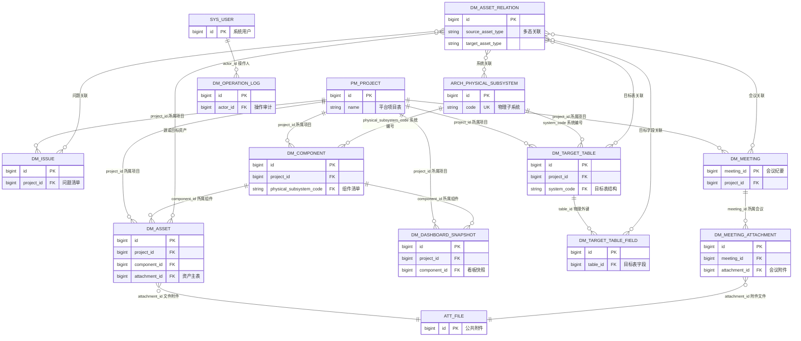
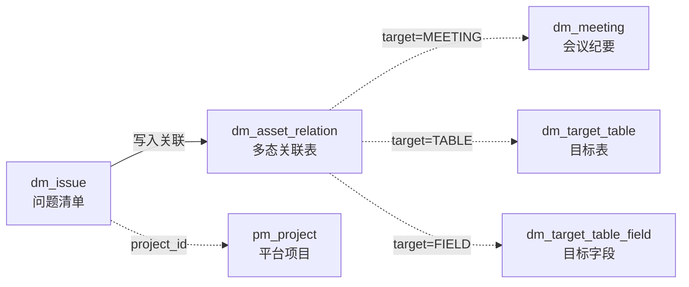
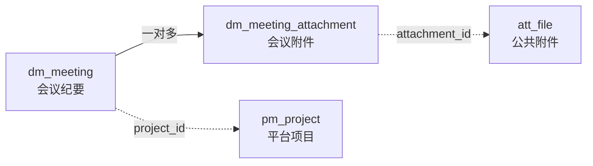
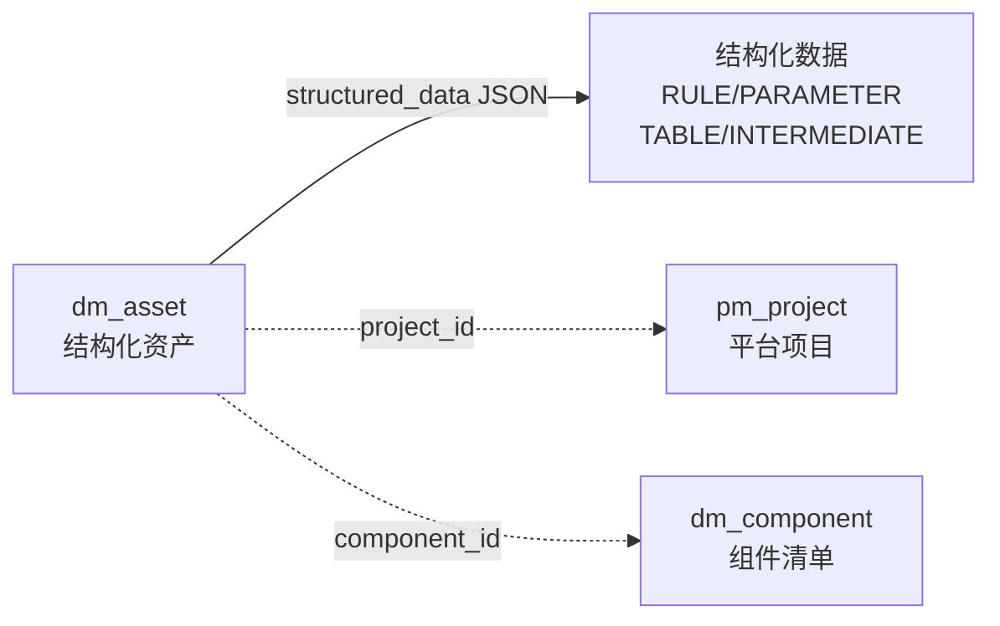

# 数据迁移模型数据库结构与关系视图

> 需求：`REQ-20260820-031`  
> 数据源：本地 MySQL `ccb_platform` 只读查询（2026-08-31 复核）
> 表范围：V98 后的 `dm_%` 表
> 说明：`information_schema.TABLE_ROWS` 为估算行数，不代表精确业务计数。

## 1. 表清单（V98 后现存 10 张）

| 表名 | 行数 | 中文说明 | 当前状态 |
| --- | ---: | --- | --- |
| `dm_asset` | 1 | 文件及结构化资产主表（16 种资产类型） | 使用中 |
| `dm_asset_relation` | 0 | 资产间多态关联 | 使用中 |
| `dm_component` | 4 | 项目组件/系统清单 | 使用中 |
| `dm_dashboard_snapshot` | 2 | 看板指标快照 | 使用中 |
| `dm_issue` | 0 | 独立问题清单 | V93 新增 |
| `dm_meeting` | 0 | 会议纪要独立表 | V95 新增 |
| `dm_meeting_attachment` | 0 | 会议纪要多附件关联 | V96 新增 |
| `dm_operation_log` | 78 | 写操作审计 | 使用中 |
| `dm_target_table` | 19 | 目标表/中间表定义 | 使用中 |
| `dm_target_table_field` | 64 | 目标表字段定义 | 使用中 |

## 2. 清理分析

### 2.1 已完成清理

| 清理项 | 版本 | 说明 |
| --- | --- | --- |
| `dm_asset` ISSUE 数据 | V93 | `DELETE FROM dm_asset WHERE asset_type='ISSUE'`，当前 0 行 |
| 兼容冗余列和专题类型表 | V98 | 删除 `dm_meeting.project_name/attachment_id/file_name`、`dm_issue.system_name`、`dm_target_table_field.table_code`、`dm_asset.object_key`，并删除未接入的 `dm_topic_type` |

### 2.2 V98 前置校验

| 表 | 字段 | 建议 | 原因 |
| --- | --- | --- | --- |
| `dm_asset` | `object_key` 存量 | **发布前必须为 0 条未绑定记录** | V98 删除列后不再支持 MinIO 对象键回退；需先将可用对象转为 `att_file` 绑定，无法映射的记录需经业务确认后处理 |

### 2.3 不建议清理的字段

| 表 | 字段 | 说明 |
| --- | --- | --- |
| `dm_asset` | `structured_data` | RULE/PARAMETER/TABLE_STRUCTURE/INTERMEDIATE_TABLE 的核心数据列 |
| `dm_asset` | `report_period`/`report_date`/`keywords` | REPORT 专属字段，`ReportService` 活跃读写 |
| `dm_component` | `total_check` | 前端编辑/列表/筛选/导出均活跃使用 |
| `dm_component` | `physical_subsystem_code` | 组件核心身份字段，多处 JOIN 查询 |

## 3. 字段结构详表

> 标记：PK = 主键，? = 允许为空

### 3.1 `dm_asset` — 文件及结构化资产主表

资产类型枚举（16 种）：REPORT、MEETING、PLAN、MAPPING_DOC、VALIDATION_DOC、PARAMETER、DEPENDENCY、SCRIPT、TOPIC、RELEASE_DRILL、TRANSFORM_DOC、CONFIG、OTHER、RULE、TABLE_STRUCTURE、INTERMEDIATE_TABLE

| 字段 | 类型 | 可空 | 中文说明 | 状态 |
| --- | --- | --- | --- | --- |
| `id` | bigint PK | - | 主键 ID | 活跃 |
| `tenant_id` | bigint | NOT NULL | 租户 ID | 活跃 |
| `project_id` | bigint | NOT NULL | 所属项目 | 活跃 |
| `component_id` | bigint | ? | 所属组件 | 活跃 |
| `asset_type` | varchar(32) | NOT NULL | 资产类型枚举 | 活跃 |
| `report_period` | varchar(16) | ? | 汇报周期（仅 REPORT） | 活跃 |
| `asset_code` | varchar(96) | NOT NULL | 资产编号，项目内同类型唯一 | 活跃 |
| `asset_name` | varchar(255) | NOT NULL | 资产名称 | 活跃 |
| `report_date` | date | ? | 汇报日期（仅 REPORT） | 活跃 |
| `keywords` | varchar(500) | ? | 关键字，逗号分隔（仅 REPORT） | 活跃 |
| `content_type` | varchar(160) | ? | MIME 类型 | 活跃 |
| `file_size` | bigint | ? | 文件大小（字节） | 活跃 |
| `attachment_id` | bigint | ? | 公共附件 ID | 活跃 |
| `checksum_md5` | char(32) | ? | 文件 MD5 校验值 | 活跃 |
| `structured_data` | json | ? | 结构化数据 JSON | 活跃 |
| `owner_id` | bigint | NOT NULL | 负责人 | 活跃 |
| `deleted` | tinyint | NOT NULL | 逻辑删除 0/1 | 活跃 |
| `deleted_by` | bigint | ? | 删除人 | ⚠️ 部分 |
| `deleted_at` | timestamp | ? | 删除时间 | ⚠️ 部分 |
| `created_at` | timestamp | NOT NULL | 创建时间 | 活跃 |
| `created_by` | bigint | ? | 创建人 | 活跃 |
| `updated_by` | bigint | ? | 最后编辑人 | 活跃 |
| `updated_at` | timestamp | NOT NULL | 最后更新时间 | 活跃 |

### 3.2 `dm_issue` — 独立问题清单

| 字段 | 类型 | 可空 | 中文说明 |
| --- | --- | --- | --- |
| `id` | bigint PK | - | 主键 ID |
| `tenant_id` | bigint | NOT NULL | 租户 ID |
| `project_id` | bigint | NOT NULL | 所属项目 |
| `issue_code` | varchar(96) | NOT NULL | 问题编号，项目内唯一 |
| `issue_name` | varchar(255) | NOT NULL | 问题名称 |
| `granularity` | varchar(16) | ? | 粒度：PROJECT/COMPONENT/TABLE/FIELD |
| `system_code` | varchar(96) | ? | 系统编号 |
| `issue_source` | varchar(32) | ? | 问题来源 |
| `defect_type` | varchar(32) | ? | 缺陷类型 |
| `issue_description` | text | ? | 问题描述 |
| `solution` | text | ? | 解决方案 |
| `meeting_conclusion` | text | ? | 会议结论 |
| `processing_steps` | text | ? | 处理步骤 |
| `business_scenario` | varchar(500) | ? | 所属业务场景 |
| `handler` | varchar(160) | ? | 处理人 |
| `responsible_party` | varchar(160) | ? | 责任方 |
| `keywords` | varchar(500) | ? | 关键字，逗号分隔 |
| `frequency` | varchar(16) | ? | 发生频率 |
| `owner_id` | bigint | NOT NULL | 负责人 |
| `deleted` | tinyint | NOT NULL | 逻辑删除 0/1 |
| `created_at` | timestamp | NOT NULL | 创建时间 |
| `updated_at` | timestamp | NOT NULL | 最后更新时间 |
| `created_by` | bigint | ? | 创建人 |
| `updated_by` | bigint | ? | 最后编辑人 |
| `deleted_by` | bigint | ? | 删除人 |
| `deleted_at` | timestamp | ? | 删除时间 |

### 3.3 `dm_meeting` — 会议纪要独立表

| 字段 | 类型 | 可空 | 中文说明 |
| --- | --- | --- | --- |
| `meeting_id` | bigint PK | - | 主键 ID |
| `tenant_id` | bigint | NOT NULL | 租户 ID |
| `project_id` | bigint | NOT NULL | 所属项目 |
| `granularity` | varchar(50) | NOT NULL | 粒度 |
| `meeting_source` | varchar(50) | NOT NULL | 来源 |
| `meeting_title` | varchar(500) | NOT NULL | 会议标题 |
| `meeting_content` | text | ? | 会议内容 |
| `meeting_conclusion` | text | ? | 会议结论 |
| `business_scenario` | varchar(500) | ? | 所属业务场景 |
| `keywords` | json | ? | 关键字（JSON 数组） |
| `deleted` | tinyint(1) | NOT NULL | 逻辑删除 0/1 |
| `deleted_by` | bigint | ? | 删除人 |
| `deleted_at` | datetime(6) | ? | 删除时间 |
| `created_by` | bigint | NOT NULL | 创建人 |
| `created_at` | datetime(6) | NOT NULL | 创建时间 |
| `updated_by` | bigint | ? | 最后编辑人 |
| `updated_at` | datetime(6) | ? | 最后更新时间 |

### 3.4 `dm_meeting_attachment` — 会议纪要多附件关联表

| 字段 | 类型 | 可空 | 中文说明 |
| --- | --- | --- | --- |
| `id` | bigint PK | - | 主键 ID |
| `tenant_id` | bigint | NOT NULL | 租户 ID |
| `meeting_id` | bigint | NOT NULL | 所属会议 |
| `attachment_id` | bigint | NOT NULL | 公共附件 ID |
| `file_name` | varchar(500) | NOT NULL | 附件文件名 |
| `sort_order` | int | NOT NULL | 排序序号 |
| `deleted` | tinyint(1) | NOT NULL | 逻辑删除 0/1 |
| `deleted_by` | bigint | ? | 删除人 |
| `deleted_at` | datetime(6) | ? | 删除时间 |
| `created_by` | bigint | NOT NULL | 创建人 |
| `created_at` | datetime(6) | NOT NULL | 创建时间 |
| `active_attachment_key` | varchar(256) | ? | 活动附件唯一键（生成列，已删除行为空） |

### 3.5 `dm_asset_relation` — 资产间多态关联表

| 字段 | 类型 | 可空 | 中文说明 |
| --- | --- | --- | --- |
| `id` | bigint PK | - | 主键 ID |
| `tenant_id` | bigint | NOT NULL | 租户 ID |
| `source_asset_id` | bigint | NOT NULL | 源实体 ID |
| `source_asset_type` | varchar(32) | NOT NULL | 源实体类型 |
| `target_asset_id` | bigint | NOT NULL | 目标实体 ID |
| `target_asset_type` | varchar(32) | NOT NULL | 目标实体类型 |
| `created_at` | datetime | NOT NULL | 创建时间 |
| `created_by` | bigint | NOT NULL | 创建人 |

### 3.6 `dm_component` — 项目组件/系统清单表

| 字段 | 类型 | 可空 | 中文说明 |
| --- | --- | --- | --- |
| `id` | bigint PK | - | 主键 ID |
| `tenant_id` | bigint | NOT NULL | 租户 ID |
| `project_id` | bigint | NOT NULL | 所属项目 |
| `owner_id` | bigint | NOT NULL | 负责人 |
| `deleted` | tinyint | NOT NULL | 逻辑删除 0/1 |
| `created_at` | timestamp | NOT NULL | 创建时间 |
| `updated_at` | timestamp | NOT NULL | 最后更新时间 |
| `physical_subsystem_code` | varchar(64) | ? | 系统编号，项目内唯一 |
| `total_check` | tinyint | NOT NULL | 是否涉及总分核对 0/1 |
| `created_by` | bigint | ? | 创建人 |
| `updated_by` | bigint | ? | 最后编辑人 |

### 3.7 `dm_dashboard_snapshot` — 看板指标快照表

| 字段 | 类型 | 可空 | 中文说明 |
| --- | --- | --- | --- |
| `id` | bigint PK | - | 主键 ID |
| `tenant_id` | bigint | NOT NULL | 租户 ID |
| `snapshot_date` | date | NOT NULL | 快照日期 |
| `project_id` | bigint | ? | 所属项目 |
| `component_id` | bigint | ? | 所属组件 |
| `metric_code` | varchar(64) | NOT NULL | 指标编码 |
| `metric_value` | decimal(20,4) | NOT NULL | 指标值 |
| `created_at` | timestamp | NOT NULL | 创建时间 |

### 3.8 `dm_operation_log` — 写操作审计表

| 字段 | 类型 | 可空 | 中文说明 |
| --- | --- | --- | --- |
| `id` | bigint PK | - | 主键 ID |
| `tenant_id` | bigint | NOT NULL | 租户 ID |
| `actor_id` | bigint | NOT NULL | 操作人 ID |
| `operation_code` | varchar(64) | NOT NULL | 操作码 |
| `entity_type` | varchar(64) | NOT NULL | 实体类型（多态） |
| `entity_id` | bigint | ? | 实体 ID（多态） |
| `result_code` | varchar(16) | NOT NULL | 结果码：SUCCESS/FAIL |
| `trace_id` | varchar(64) | ? | 链路追踪 ID |
| `detail_json` | json | ? | 操作详情 JSON |
| `created_at` | timestamp | NOT NULL | 创建时间 |

### 3.9 `dm_target_table` — 目标表结构主表

`table_category` 取值：TARGET（目标表）/ INTERMEDIATE（中间表）

| 字段 | 类型 | 可空 | 中文说明 |
| --- | --- | --- | --- |
| `id` | bigint PK | - | 主键 ID |
| `tenant_id` | bigint | NOT NULL | 租户 ID |
| `table_code` | varchar(64) | NOT NULL | 表编号，项目内唯一 |
| `project_id` | bigint | NOT NULL | 所属项目 |
| `system_code` | varchar(64) | NOT NULL | 系统编号 |
| `table_name_en` | varchar(128) | NOT NULL | 英文表名 |
| `table_name_cn` | varchar(128) | NOT NULL | 中文表名 |
| `table_meaning` | varchar(500) | ? | 表含义说明 |
| `table_category` | varchar(16) | NOT NULL | 表类别：TARGET/INTERMEDIATE |
| `owner_id` | bigint | NOT NULL | 负责人 |
| `created_at` | timestamp | NOT NULL | 创建时间 |
| `created_by` | bigint | ? | 创建人 |
| `updated_at` | timestamp | NOT NULL | 最后更新时间 |
| `updated_by` | bigint | ? | 最后编辑人 |
| `deleted` | tinyint | NOT NULL | 逻辑删除 0/1 |

### 3.10 `dm_target_table_field` — 目标表字段明细表

| 字段 | 类型 | 可空 | 中文说明 |
| --- | --- | --- | --- |
| `id` | bigint PK | - | 主键 ID |
| `tenant_id` | bigint | NOT NULL | 租户 ID |
| `field_code` | varchar(64) | NOT NULL | 字段编号 |
| `table_id` | bigint | NOT NULL | 所属目标表（物理外键） |
| `field_name_en` | varchar(128) | NOT NULL | 英文字段名 |
| `field_name_cn` | varchar(128) | NOT NULL | 中文字段名 |
| `field_meaning` | varchar(500) | ? | 字段含义说明 |
| `code_description` | varchar(500) | ? | 编码说明 |
| `is_key_field` | tinyint | NOT NULL | 是否关键字段 0/1 |
| `oracle_type` | varchar(64) | ? | Oracle 类型 |
| `mysql_type` | varchar(64) | ? | MySQL 类型 |
| `is_nullable` | tinyint | NOT NULL | 是否可空 0/1 |
| `is_primary_key` | tinyint | NOT NULL | 是否主键 0/1 |
| `dict_code` | varchar(64) | ? | 数据字典编码 |
| `owner_id` | bigint | NOT NULL | 负责人 |
| `created_at` | timestamp | NOT NULL | 创建时间 |
| `created_by` | bigint | ? | 创建人 |
| `updated_at` | timestamp | NOT NULL | 最后更新时间 |
| `updated_by` | bigint | ? | 最后编辑人 |
| `deleted` | tinyint | NOT NULL | 逻辑删除 0/1 |

## 4. 关系分类

### 4.1 数据库物理外键

`dm_%` 表之间仅一条物理外键：

```
dm_target_table_field.table_id -> dm_target_table.id
约束名：fk_target_field_table
```

### 4.2 服务层逻辑关系

| 来源表 | 来源字段 | 目标表 | 目标字段 | 中文说明 |
| --- | --- | --- | --- | --- |
| `dm_asset` | `project_id` | `pm_project` | `id` | 资产所属项目 |
| `dm_asset` | `component_id` | `dm_component` | `id` | 资产所属组件 |
| `dm_asset` | `attachment_id` | `att_file` | `id` | 资产文件附件 |
| `dm_issue` | `project_id` | `pm_project` | `id` | 问题所属项目 |
| `dm_meeting` | `project_id` | `pm_project` | `id` | 会议所属项目 |
| `dm_meeting_attachment` | `meeting_id` | `dm_meeting` | `meeting_id` | 附件所属会议 |
| `dm_meeting_attachment` | `attachment_id` | `att_file` | `id` | 会议附件文件 |
| `dm_component` | `project_id` | `pm_project` | `id` | 组件所属项目 |
| `dm_component` | `physical_subsystem_code` | `arch_physical_subsystem` | `code` | 组件对应的物理子系统 |
| `dm_dashboard_snapshot` | `project_id` | `pm_project` | `id` | 快照所属项目 |
| `dm_dashboard_snapshot` | `component_id` | `dm_component` | `id` | 快照所属组件 |
| `dm_target_table` | `project_id` | `pm_project` | `id` | 目标表所属项目 |
| `dm_target_table` | `system_code` | `arch_physical_subsystem` | `code` | 目标表所属系统 |

审计字段 `owner_id`/`created_by`/`updated_by`/`deleted_by` 均关联 `sys_user.id`，无物理外键。

### 4.3 多态关系

| 表 | 多态字段组 | 可指向 | 使用者 |
| --- | --- | --- | --- |
| `dm_asset_relation` | `source_asset_id` + `source_asset_type` | `dm_asset`、`dm_issue`、`dm_meeting` | IssueService、MeetingService |
| `dm_asset_relation` | `target_asset_id` + `target_asset_type` | `dm_asset`、`dm_issue`、`dm_meeting`、`arch_physical_subsystem`、`dm_target_table`、`dm_target_table_field` | IssueService、MeetingService |
| `dm_operation_log` | `entity_type` + `entity_id` | 所有业务实体 | 操作审计 |

## 5. Mermaid 关系视图

### 5.1 全局 ER 图



标注 `物理外键` 的关系是数据库物理约束；其余均为服务层逻辑关系。

### 5.2 问题清单关联流程



### 5.3 会议纪要关联流程



### 5.4 结构化资产关联流程



## 6. 完整性检查

| 检查项 | 结果 |
| --- | ---: |
| `dm_target_table_field` 孤立字段 | 0 |
| 有效目标表找不到 `pm_project` | 0 |
| 有效资产找不到对应组件 | 0 |
| 有效资产找不到对应附件 | 0 |
| `dm_asset_relation` 当前记录数 | 0 |
| `dm_issue` 当前行数 | 0（V93 后无历史 ISSUE） |
| `dm_asset` 中 `asset_type='ISSUE'` 行数 | 0 |
| `dm_meeting` 当前行数 | 0 |
| `dm_meeting_attachment` 当前行数 | 0 |

本文件只记录结构和脱敏统计，不包含数据库密码、对象存储密钥或业务明细。

## 7. 菜单功能与库表映射

### 7.1 菜单基线

V84 建立的菜单树为 `数据迁移(699)` 下的三个目录：`数迁资产看板(700)`、`数迁资产内容管理(720)`、`基础资料管理(740)`。V86 又删除了 `DataMigrationProjects`（项目清单）及其菜单、权限和角色绑定；因此按当前 V86/V98 数据库和路由，实际可用功能入口为 **16 个**（原始需求曾写 17 个）。回收站存在前端路由，但不是 V84 正式菜单种子中的独立入口。

### 7.2 16 个有效菜单逐项映射

| 目录 | 菜单（路由） | 实际实现 | 直接使用的业务表 | 主要关系/用途 |
| --- | --- | --- | --- | --- |
| 数迁资产看板 | 整体看板 `/data-migration/dashboard/overall` | `DashboardService.overall` | `dm_dashboard_snapshot`、`dm_asset`、`dm_component`、`pm_project` | 优先读租户最新快照的项目/组件/资产总量；按资产类型实时聚合 `dm_asset`。 |
| 数迁资产看板 | 组件看板 `/data-migration/dashboard/components` | `DashboardService.component` | `dm_component`、`dm_asset`、`arch_physical_subsystem` | `dm_component` 左连接 `dm_asset` 计数，并按 `physical_subsystem_code` 关联物理子系统显示名称；当前实现是实时聚合，不读快照。 |
| 数迁资产内容管理 | 汇报材料 `/data-migration/content/reports` | `ReportService` | `dm_asset(asset_type='REPORT')`、`pm_project`、`att_file`（通过 AttachmentGateway）、`dm_operation_log` | `dm_asset.project_id -> pm_project.id`；`attachment_id -> att_file.id`；上传、替换、删除、恢复、清理均写审计。 |
| 数迁资产内容管理 | 会议纪要 `/data-migration/content/meetings` | `MeetingService` | `dm_meeting`、`dm_meeting_attachment`、`dm_asset_relation`、`dm_issue`、`dm_component`、`arch_physical_subsystem`、`pm_project`、`sys_user`、`att_file`、`dm_operation_log` | 会议主表关联项目；附件表是一对多；关系表保存会议-系统、会议-问题；系统通过组件投影到物理子系统。 |
| 数迁资产内容管理 | 迁移方案 `/data-migration/content/plans` | `AssetService`（文件型） | `dm_asset(asset_type='PLAN')`、`pm_project`、`att_file`、`dm_operation_log` | 通用文件资产，文件元数据落 `dm_asset`，文件实体由公共附件表/对象存储维护。 |
| 数迁资产内容管理 | 迁移映射 `/data-migration/content/mappings` | `AssetService`（文件型） | `dm_asset(asset_type='MAPPING_DOC')`、`pm_project`、`att_file`、`dm_operation_log` | 与迁移方案共用同一资产表，通过 `asset_type` 分区。 |
| 数迁资产内容管理 | 迁移检核规则 `/data-migration/content/validation-rules` | `StructuredAssetService` | `dm_asset(asset_type='RULE')`、`pm_project`、`dm_component`、`dm_operation_log` | 规则主体保存在 `structured_data` JSON；项目/组件只做租户和实体校验。 |
| 数迁资产内容管理 | 迁移参数 `/data-migration/content/parameters` | `StructuredAssetService` | `dm_asset(asset_type='PARAMETER')`、`pm_project`、`dm_component`、`dm_operation_log` | 参数主体保存在 `structured_data` JSON；与规则共用结构化资产接口。 |
| 数迁资产内容管理 | 迁移过程依赖文件 `/data-migration/content/dependencies` | `AssetService`（文件型） | `dm_asset(asset_type='DEPENDENCY')`、`pm_project`、`att_file`、`dm_operation_log` | 文件型资产共用上传、下载、逻辑删除和附件绑定生命周期。 |
| 数迁资产内容管理 | 迁移程序 `/data-migration/content/programs` | `AssetService`（文件型） | `dm_asset(asset_type='SCRIPT')`、`pm_project`、`att_file`、`dm_operation_log` | 通过 `asset_type='SCRIPT'` 区分程序文件。 |
| 数迁资产内容管理 | 专题材料 `/data-migration/content/topics` | `AssetService`（文件型） | `dm_asset(asset_type='TOPIC')`、`pm_project`、`att_file`、`dm_operation_log` | 当前页面上传的是专题文件；专题类型字典未纳入当前功能，相关孤立表已由 V98 删除。 |
| 数迁资产内容管理 | 投产及演练 `/data-migration/content/release-drills` | `AssetService`（文件型） | `dm_asset(asset_type='RELEASE_DRILL')`、`pm_project`、`att_file`、`dm_operation_log` | 通过通用文件资产表保存。 |
| 数迁资产内容管理 | 问题清单 `/data-migration/content/issues` | `IssueService` + `IssueExcelService` | `dm_issue`、`dm_asset_relation`、`dm_target_table`、`dm_target_table_field`、`dm_meeting`、`pm_project`、`dm_component`、`arch_physical_subsystem`、`sys_user`、`dm_operation_log` | 问题主体独立存储；关系表保存问题-会议/表/字段；表、字段和会议均按租户、项目、未删除状态校验。 |
| 基础资料管理 | 系统/组件清单 `/data-migration/base/components` | `ProjectComponentService` | `dm_component`、`pm_project`、`arch_physical_subsystem`、`sys_user`、`dm_asset`、`dm_operation_log` | 组件只保存系统编号和 `total_check`；系统名称、事业群、负责人等由物理子系统只读投影；资产计数按 `dm_asset.component_id` 聚合。 |
| 基础资料管理 | 目标表结构 `/data-migration/base/target-tables` | `TargetTableService`，`category=TARGET` | `dm_target_table`、`dm_target_table_field`、`pm_project`、`arch_physical_subsystem`、`sys_user`、`dm_operation_log` | 主表一对多字段表；唯一性按项目+系统+表名、表内字段名校验。 |
| 基础资料管理 | 中间表结构 `/data-migration/base/intermediate-tables` | 同一 `TargetTableService`，`category=INTERMEDIATE` | `dm_target_table`、`dm_target_table_field`、`pm_project`、`arch_physical_subsystem`、`sys_user`、`dm_operation_log` | 与目标表共用物理表，通过 `table_category` 区分；删除表时服务层级联软删字段。 |

### 7.3 非正式菜单但可达的回收站路由

`/data-migration/content/recycle-bin` 当前前端调用的是 `ReportService` 的汇报材料回收站接口，只展示 `dm_asset(asset_type='REPORT')`；而通用 `AssetController` 另有 `/api/data-migration/recycle-bin` 可查询多种通用资产，问题和会议又分别有独立回收站接口。由此形成“前端回收站只覆盖汇报材料、后端能力分散”的现状，与“全部内容类型统一进入回收站”的目标不完全一致。

## 8. 设计合理性与冗余评估

### 8.1 合理设计

- **按业务复杂度拆分存储**：文件型/规则参数共用 `dm_asset`，问题独立为 `dm_issue`，会议独立为 `dm_meeting`，表结构拆为 `dm_target_table` + `dm_target_table_field`，避免把高频筛选字段全部塞入 JSON。
- **租户和逻辑删除维度完整**：业务表普遍带 `tenant_id`、`deleted`、创建/更新审计列，列表索引大多包含租户和删除状态。
- **附件边界清晰**：文件内容通过公共附件能力绑定，业务表只保存 `attachment_id`；回收站/清理由业务服务编排附件生命周期。
- **关系表独立**：`dm_asset_relation` 支持问题、会议、表、字段等跨对象关联，唯一键防止同一方向重复关系。
- **字段级表结构已正规化**：`dm_target_table_field.table_id` 有物理外键，表删除时服务层同步处理字段，支持字段粒度筛选和导出。

### 8.2 已处理的冗余或过渡字段

| 字段/设计 | 判断 | 影响与建议 |
| --- | --- | --- |
| `dm_meeting.project_name` | 已物理删除（V98） | 统一通过 `project_id -> pm_project.project_name` 投影。 |
| `dm_meeting.attachment_id`、`file_name` | 已物理删除（V98） | 统一通过 `dm_meeting_attachment` 一对多关系和首附件子查询投影。 |
| `dm_issue.system_name` | 已物理删除（V98） | 统一通过 `system_code -> arch_physical_subsystem` 投影。 |
| `dm_target_table_field.table_code` | 已物理删除（V98） | 统一通过 `table_id -> dm_target_table.table_code` JOIN 投影。 |
| `dm_asset.object_key` | 已物理删除（V98） | 文件资产统一使用公共 `att_file` 绑定；迁移前必须完成历史对象键补偿。 |
| `dm_asset.owner_id` 与报告 `created_by` | 语义重叠 | 报告上传时二者被写成同一用户；如果负责人未来可变则不算严格重复，否则可只保留创建人并把负责人建成明确的可变业务字段。 |
| `dm_project` | 历史遗留表 | 项目数据已收敛到平台 `pm_project`，当前模块不再使用；应保持只读/归档状态，禁止重新接入。 |

### 8.3 需要优先修正的结构或实现缺口

| 优先级 | 问题 | 证据 | 建议 |
| --- | --- | --- | --- |
| P0 | 问题清单关联会议曾查询旧表 | 已修正：会议选项、名称聚合和关系目标校验统一使用 `dm_meeting.meeting_id`。 | 保持 `dm_asset_relation` 的多态类型为 `MEETING`，但目标主键只解释为 `dm_meeting.meeting_id`。 |
| P0 | 会议彻底清理曾遗漏附件关联和附件对象 | 已修正：`MeetingService.purge/purgeAll` 先解绑会议业务附件、删除 `dm_meeting_attachment`，再清理双向关系和会议主表。 | 对历史未绑定附件仅删除业务关联行，不调用其他业务的解绑接口；上线前应做孤儿附件盘点。 |
| P1 | 通用资产逻辑删除曾不写删除审计字段 | 已修正：`AssetService.delete/restore` 写入或清空 `deleted_by/deleted_at`，并同步更新操作人和时间。 | 后续可抽取共享软删除组件，避免不同业务服务重复实现。 |
| P1 | 看板快照语义不一致 | `DashboardService.component` 直接实时 COUNT，不读取 `dm_dashboard_snapshot`；整体看板才优先读快照。 | 明确“组件看板实时”还是“组件看板快照”；若要求每日快照，应按快照表查询并保留钻取条件。 |
| P1 | `dm_topic_type` 成为孤立表 | V97 建表但无任何业务引用；专题材料仍只是 `dm_asset(TOPIC)` 文件。 | 已由 V98 删除，后续如需专题分类应以独立需求重新设计，不在当前模型中保留孤立表。 |
| P1 | 物理约束不足 | 除 `dm_target_table_field.table_id` 外，项目、组件、附件、用户及多态关系均无 FK；`dm_asset_relation` 可留下指向已删除/不存在对象的行。 | 保留跨模块不建 FK 的架构也可以，但必须在服务层统一做存在性、租户、删除状态校验，并为 purge 双向清理关系。 |
| P1 | 快照唯一键的 NULL 语义 | `uk_dm_snapshot(tenant_id,snapshot_date,project_id,component_id,metric_code)` 中项目/组件允许 NULL；MySQL 唯一索引对 NULL 不视为相等，多个全局指标可能重复。 | 使用生成列/哨兵值或拆分全局与项目/组件快照表，确保同一天同指标真正唯一。 |
| P2 | `asset_type`、`table_category`、枚举字段仅靠 Java 校验 | 数据库没有 CHECK/参考码表；V97 对 `dm_asset` 的注释列出的类型与 `AssetService.TYPES` 实际值也不完全一致。 | 统一代码值来源，至少增加迁移级 CHECK（或参考码表）和数据修复脚本，避免旁路写入脏值。 |
| P2 | 软删除唯一键策略不统一 | 多数唯一键把 `deleted` 直接放入键中，重复删除记录仍可能互相冲突；只有 `dm_issue` 在 V94 用生成列实现“活动记录唯一”。 | 将活动唯一约束统一为生成列/函数索引策略，并为恢复时的冲突行为定义一致契约。 |
| P2 | 会议及附件索引缺少租户前缀 | V95/V96 原索引以 `project_id`、`meeting_id` 开头。 | 已由 V98 重建为租户前缀复合索引，并为活动会议附件增加唯一约束。 |

## 9. 结论

整体模型方向是合理的：核心领域已从早期“所有内容塞入 `dm_asset.structured_data`”逐步拆为问题、会议、表结构和附件关系，租户隔离、审计和权限也有明确落点。当前主要风险不在基础表数量，而在**过渡模型尚未完全收敛**：主表兼容字段、未使用的专题类型表、通用回收站审计不一致，以及多态关系缺少数据库级完整性。

V98 已完成兼容列和孤立表的物理收敛，并修正 V96/V97 的附件唯一性、租户索引和模型注释问题。后续仍需处理看板快照语义、快照 NULL 唯一键、枚举约束和多态关系数据库完整性。上述结论基于当前仓库 V84–V98 SQL、后端 Controller/Service、前端路由及本地脱敏统计；未连接生产库，也未使用真实业务数据。

## 10. 本轮已实施的修正

- 问题清单的会议选项和关联会议名称统一查询 `dm_meeting`，关系目标使用 `meeting_id`，不再依赖已下线的 `dm_asset(asset_type='MEETING')`。
- 会议彻底删除会先解绑按 `DATA_MIGRATION_MEETING` 绑定的附件，再删除 `dm_meeting_attachment` 行，并清理会议作为源或目标的全部 `dm_asset_relation`；新增会议附件在保存时完成公共附件绑定，并增加租户/生命周期访问策略。
- 通用资产逻辑删除和恢复补齐 `deleted_by/deleted_at`、`updated_by/updated_at`，与报告资产的审计语义一致。
- V98 已物理删除 `dm_meeting.project_name`、`attachment_id/file_name`、`dm_issue.system_name`、`dm_target_table_field.table_code`、`dm_asset.object_key`，并删除未使用的 `dm_topic_type`；服务层保留必要的 JOIN/子查询投影，不再写入重复事实。
- V98 同步修复 V96/V97 遗留问题：活动会议附件唯一约束、租户前缀索引和 `dm_asset` 表注释收敛。
