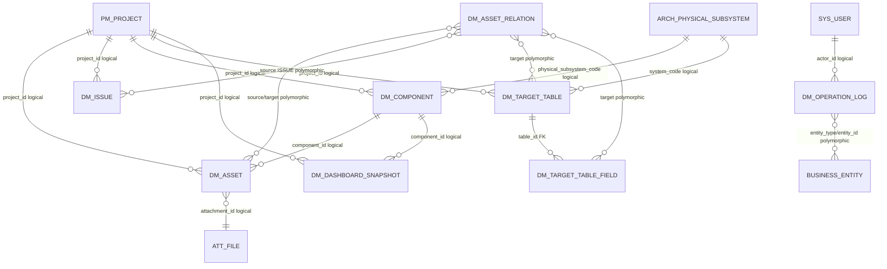
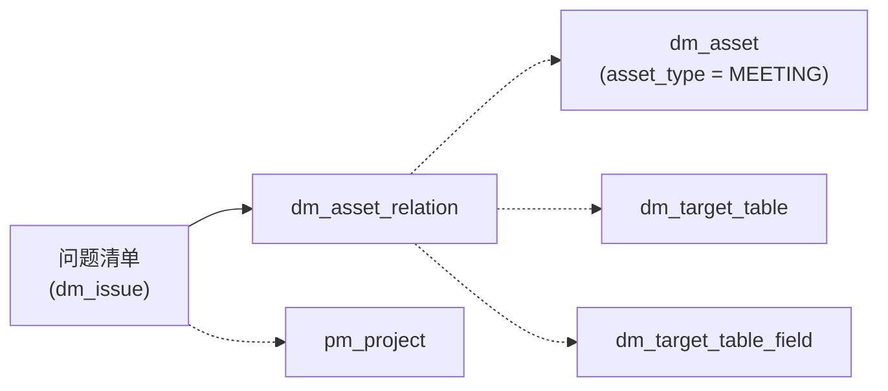

# 数据迁移模型数据库结构与关系视图

> 需求：`REQ-20260820-031`  
> 数据源：本地 MySQL `ccb_platform` 只读查询（2026-08-25 复核）
> 表范围：V93 前的 `dm_%` 表，以及 V93 后的现存表复核
> 说明：`information_schema.TABLE_ROWS` 为估算行数，不代表精确业务计数。

## 1. 表清单（V93 前 8 张，V93 后现存 8 张）

V93 不迁移历史 ISSUE 数据，而是新增 `dm_issue`；`dm_project` 仅作为已清理的历史表记录，不计入现存表数量。因此 V93 前的 8 张为 `dm_project` 加其余 7 张，V93 后的 8 张为 `dm_issue` 加其余 7 张。

| 表名 | 估算行数 | 说明 | 当前状态 |
| --- | ---: | --- | --- |
| `dm_asset` | 1 | 文件及结构化资产主表 | 使用中 |
| `dm_asset_relation` | 0 | 资产间多态关联 | 使用中 |
| `dm_issue` | 0 | 独立问题清单 | V93 新增并已验证 |
| `dm_component` | 4 | 项目组件/系统清单 | 使用中 |
| `dm_dashboard_snapshot` | 2 | 看板指标快照 | 使用中 |
| `dm_operation_log` | 78 | 数据迁移操作审计 | 使用中 |
| `dm_project` | - | 旧版项目主表（历史） | 已清理，不属于当前模型 |
| `dm_target_table` | 19 | 目标表和中间表定义 | 使用中 |
| `dm_target_table_field` | 64 | 目标表字段定义 | 使用中 |

V93 后本地统计：`dm_asset` 1 条、`dm_component` 4 条、`dm_dashboard_snapshot` 2 条、`dm_operation_log` 78 条、`dm_target_table` 19 条、`dm_target_table_field` 64 条、`dm_asset_relation` 0 条、`dm_issue` 0 条。`dm_issue` 已建表但没有历史数据；当前数据库不再包含 `dm_project`。

> **问题清单说明**：V93 新增独立 `dm_issue` 表。历史 `dm_asset(asset_type='ISSUE')` 数据不迁移、不归档，迁移时删除旧问题关系和旧问题行；`dm_asset` 仍保留 REPORT、RULE、PARAMETER 和附件资产所需的通用字段。

## 2. 字段结构

标记：`PK` 为主键，`?` 为允许为空。

### `dm_asset`

`id bigint PK`, `tenant_id bigint`, `project_id bigint`, `component_id bigint?`, `asset_type varchar(32)`, `report_period varchar(16)?`, `asset_code varchar(96)`, `asset_name varchar(255)`, `report_date date?`, `keywords varchar(500)?`, `content_type varchar(160)?`, `file_size bigint?`, `object_key varchar(512)?`, `attachment_id bigint?`, `checksum_md5 char(32)?`, `structured_data json?`, `owner_id bigint`, `deleted tinyint`, `deleted_by bigint?`, `deleted_at timestamp?`, `created_at timestamp`, `created_by bigint?`, `updated_by bigint?`, `updated_at timestamp`。

主要索引：`uk_dm_asset_code`、`uk_dm_asset_checksum_active`、`idx_dm_asset_query`、`idx_dm_asset_owner`、`idx_dm_asset_report`。

### `dm_issue`

问题清单使用独立结构化表，按租户、项目和逻辑删除状态隔离。V93 执行前本地旧 ISSUE 记录数为 0；执行后 `dm_issue` 初始为空，旧 ISSUE 数据不复制。

实际列定义：`id bigint PK`、`tenant_id bigint`、`project_id bigint`、`issue_code varchar(96)`、`issue_name varchar(255)`、`granularity varchar(16)?`、`system_code varchar(96)?`、`system_name varchar(160)?`、`issue_source varchar(32)?`、`defect_type varchar(32)?`、`issue_description text?`、`solution text?`、`meeting_conclusion text?`、`processing_steps text?`、`business_scenario varchar(500)?`、`handler varchar(160)?`、`responsible_party varchar(160)?`、`keywords varchar(500)?`、`frequency varchar(16)?`、`owner_id bigint`、`deleted tinyint`、`created_at timestamp`、`updated_at timestamp`、`created_by bigint?`、`updated_by bigint?`、`deleted_by bigint?`、`deleted_at timestamp?`。

基础字段映射：

| 业务字段 | 存储位置 | 说明 |
| --- | --- | --- |
| 问题 ID | `dm_issue.id` | 主键 |
| 所属项目 | `dm_issue.project_id` | 逻辑关联 `pm_project.id` |
| 问题编号 | `dm_issue.issue_code` | 项目内唯一，逻辑删除记录除外 |
| 问题名称 | `dm_issue.issue_name` | 独立业务字段 |
| 问题分类 | `granularity`、`issue_source`、`defect_type`、`frequency` | 结构化枚举列 |
| 系统信息 | `system_code`、`system_name` | 系统编号及展示名称，系统名称由请求写入，不作为跨模块外键 |
| 问题内容 | `issue_description`、`solution`、`meeting_conclusion`、`processing_steps`、`business_scenario` | 结构化文本列 |
| 处置人/责任主体 | `handler`、`responsible_party` | 结构化业务列 |
| 关键字 | `keywords` | 英文逗号分隔索引 |
| 租户/所有者 | `tenant_id` / `owner_id` | 服务端数据范围和实体授权 |
| 创建/修改/删除审计 | `created_at`、`created_by`、`updated_at`、`updated_by`、`deleted_at`、`deleted_by` | 独立表审计字段 |

关联对象不再写入 JSON：

- `source_asset_type='ISSUE'`、`target_asset_type='MEETING'`：关联会议纪要资产。
- `source_asset_type='ISSUE'`、`target_asset_type='TABLE'`：关联 `dm_target_table.id`。
- `source_asset_type='ISSUE'`、`target_asset_type='FIELD'`：关联 `dm_target_table_field.id`。

问题清单接口由 `/api/data-migration/issues` 提供，支持分页、筛选、批量导入、逻辑删除和管理员回收站操作；接口读写 `dm_issue`，关系仍读写 `dm_asset_relation`。

`dm_issue` 的表级约束：

- `uk_dm_issue_code(tenant_id, project_id, issue_code, deleted)` 保证同一租户、同一项目下有效问题编号唯一；软删除记录不阻塞新编号。
- `idx_dm_issue_query`、`idx_dm_issue_owner`、`idx_dm_issue_filters`、`idx_dm_issue_system` 服务列表、权限、筛选和系统检索。
- 不建立 `project_id`、`owner_id` 或关系目标的数据库外键；这些引用必须由服务层按租户、实体类型和逻辑删除状态校验。

### `dm_asset_relation`

`id bigint PK`, `tenant_id bigint`, `source_asset_id bigint`, `source_asset_type varchar(32)`, `target_asset_id bigint`, `target_asset_type varchar(32)`, `created_at datetime`, `created_by bigint`。

该表通过 `asset_id + asset_type` 表示多态关系，不设置数据库外键。

### `dm_component`

`id bigint PK`, `tenant_id bigint`, `project_id bigint`, `owner_id bigint`, `deleted tinyint`, `created_at timestamp`, `updated_at timestamp`, `physical_subsystem_code varchar(64)?`, `total_check tinyint`, `created_by bigint?`, `updated_by bigint?`。

### `dm_dashboard_snapshot`

`id bigint PK`, `tenant_id bigint`, `snapshot_date date`, `project_id bigint?`, `component_id bigint?`, `metric_code varchar(64)`, `metric_value decimal(20,4)`, `created_at timestamp`。

唯一键：`uk_dm_snapshot(tenant_id, snapshot_date, project_id, component_id, metric_code)`。

### `dm_operation_log`

`id bigint PK`, `tenant_id bigint`, `actor_id bigint`, `operation_code varchar(64)`, `entity_type varchar(64)`, `entity_id bigint?`, `result_code varchar(16)`, `trace_id varchar(64)?`, `detail_json json?`, `created_at timestamp`。

`entity_id` 与 `entity_type` 组成多态业务实体引用。

### `dm_project`（已清理）

该遗留表已从本地 `ccb_platform` 数据库删除。删除前已生成完整备份：

```text
/home/song/.codex/backups/rddmp/dm_project-before-drop-20260824.sql
```

当前数据迁移服务使用平台项目表 `pm_project`，新功能不得重新依赖 `dm_project`。

### `dm_target_table`

`id bigint PK`, `tenant_id bigint`, `table_code varchar(64)`, `project_id bigint`, `system_code varchar(64)`, `table_name_en varchar(128)`, `table_name_cn varchar(128)`, `table_meaning varchar(500)?`, `table_category varchar(16)`, `owner_id bigint`, `created_at timestamp`, `created_by bigint?`, `updated_at timestamp`, `updated_by bigint?`, `deleted tinyint`。

`table_category` 取 `TARGET` 或 `INTERMEDIATE`。主要唯一键：`uk_target_table_code`、`uk_target_table_en`、`uk_target_table_cn`。

V88 初始 SQL 的历史列注释仍可能写有 `dm_project.id`，现行服务契约和所有查询均使用平台项目表 `pm_project.id`，不得恢复对 `dm_project` 的依赖。

### `dm_target_table_field`

`id bigint PK`, `tenant_id bigint`, `field_code varchar(64)`, `table_id bigint`, `table_code varchar(64)`, `field_name_en varchar(128)`, `field_name_cn varchar(128)`, `field_meaning varchar(500)?`, `code_description varchar(500)?`, `is_key_field tinyint`, `oracle_type varchar(64)?`, `mysql_type varchar(64)?`, `is_nullable tinyint`, `is_primary_key tinyint`, `dict_code varchar(64)?`, `owner_id bigint`, `created_at timestamp`, `created_by bigint?`, `updated_at timestamp`, `updated_by bigint?`, `deleted tinyint`。

## 3. 关系分类

### 3.1 数据库物理外键

当前数据库中 `dm_%` 表之间只有一条真实外键：

```text
dm_target_table_field.table_id
  -> dm_target_table.id
约束名：`fk_target_field_table`

`dm_issue`、`dm_asset_relation` 以及其他 `project_id`、`owner_id`、`created_by` 等引用均不设置物理外键，以保留租户隔离、软删除和多态关系的服务层控制。
```

### 3.2 服务层逻辑关系

以下关系由字段语义、服务代码和租户/软删除条件维护，数据库未建立外键：

| 来源 | 字段 | 目标 | 类型 |
| --- | --- | --- | --- |
| `dm_asset` | `project_id` | `pm_project.id` | 逻辑 |
| `dm_asset` | `component_id` | `dm_component.id` | 逻辑 |
| `dm_asset` | `attachment_id` | `att_file.id` | 逻辑 |
| `dm_component` | `project_id` | `pm_project.id` | 逻辑 |
| `dm_component` | `physical_subsystem_code` | `arch_physical_subsystem.code` | 逻辑 |
| `dm_dashboard_snapshot` | `project_id` | `pm_project.id` | 逻辑 |
| `dm_dashboard_snapshot` | `component_id` | `dm_component.id` | 逻辑 |
| `dm_target_table` | `project_id` | `pm_project.id` | 逻辑 |
| `dm_target_table` | `system_code` | `arch_physical_subsystem.code` | 逻辑 |

`owner_id`、`created_by`、`updated_by`、`deleted_by` 等审计字段按业务约定关联 `sys_user.id`，同样没有数据库外键。

### 3.3 多态关系

- `dm_asset_relation.source_asset_id + source_asset_type`：源资产，可指向 `dm_asset` 或其他资产类型。
- `dm_asset_relation.target_asset_id + target_asset_type`：目标资产，可指向 `dm_asset`、`dm_target_table`、`dm_target_table_field` 等实体。
- `dm_operation_log.entity_type + entity_id`：操作审计对应的业务实体。

应用层必须同时校验实体类型、租户边界和逻辑删除状态，不能仅按 ID 查询。

## 4. Mermaid 关系视图



图中标注 `FK` 的关系是数据库真实约束；标注 `logical` 或 `polymorphic` 的关系仅表示当前服务契约，不代表数据库外键。

问题清单的存储关系可单独概括为：



## 5. 完整性检查

- `dm_target_table_field` 孤立字段：0
- 有效目标表/中间表找不到 `pm_project`：0
- 有效资产找不到对应组件：0
- 有效资产找不到对应附件：0
- `dm_asset_relation` 当前记录数：0
- `dm_issue` 当前行数：0（V93 后无历史 ISSUE 留存）
- `dm_asset` 中 `asset_type='ISSUE'` 行数：0
- `dm_asset_relation` 中 `source_asset_type='ISSUE'` 行数：0
- `dm_project` 当前表存在性：0（已清理）

本文件只记录结构和脱敏统计，不包含数据库密码、对象存储密钥、对象键或业务明细。查询采用本地数据库只读账号执行。
